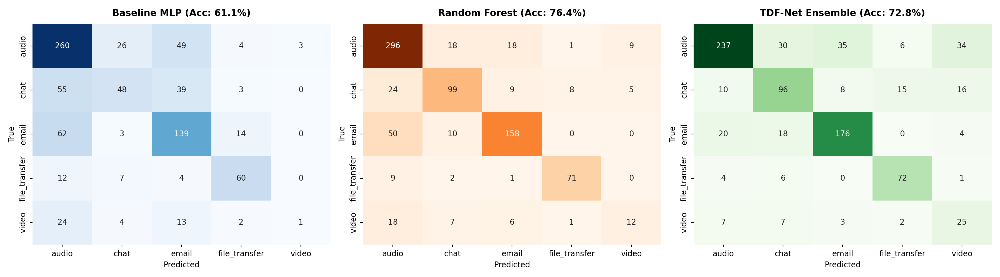

# 🌐 지능형 IoT 네트워크 (Intelligent IoT Network)

본 저장소는 충북대학교 일반대학원 산업인공지능학과 **지능형 IoT 네트워크** 교과의 강의 자료(PDF), 주차별 연구 보고서, 실습 코드(Jupyter Notebook & Python Script) 및 과제 산출물을 체계적으로 관리하는 공간입니다.

---

## 📌 교과 개요 및 목표
* **교과목명**: 지능형 IoT 네트워크 (Intelligent IoT Network)
* **소속**: 충북대학교 일반대학원 산업인공지능학과 (석사과정)
* **연구자**: 진찬언 (학번: 2026254019)
* **주요 내용**: 스마트팩토리 및 산업 인공지능 인프라를 뒷받침하는 사물인터넷(IoT) 아키텍처, OSI 7계층 네트워크 프로토콜, 무선 센서 네트워크(WSN), 엣지 컴퓨팅 및 암호화 네트워크 트래픽 분류를 위한 딥러닝 모델링 기술을 학습합니다.

---

## 📂 주차별 강의 자료 및 산출물 일람

| 주차 / 주제 | 강의 자료 | 실습 및 산출물 폴더 | 주요 학습 내용 및 핵심 기술 |
| :--- | :--- | :--- | :--- |
| **1주차** | [`지능형 IoT 네트워크(1주차 - 오리엔테이션).pdf`](./지능형%20IoT%20네트워크(1주차%20-%20오리엔테이션).pdf) | - | • IoT 개념, 발전사 및 산업 인공지능과의 융합<br>• 센서 노드, 게이트웨이, 클라우드 연계 아키텍처 |
| **2주차** | [`지능형 IoT 네트워크(2주차 - 지능형 IoT 개요).pdf`](./지능형%20IoT%20네트워크(2주차%20-%20지능형%20IoT%20개요).pdf) | - | • 지능형 IoT 시스템 구성 요소 및 스마트 센싱<br>• 온디바이스 AI, 엣지 AI와 네트워크 대역폭 최적화 |
| **3주차** | [`지능형 IoT 네트워크(3주차 - 지능형 IoT와 OSI 7계층).pdf`](./지능형%20IoT%20네트워크(3주차%20-%20지능형%20IoT%20와%20OSI%207계층).pdf) | [`3주_과제/`](./3주_과제/) | • OSI 7계층 및 TCP/IP 5계층 프로토콜 스택<br>• 네트워크 패킷 캡처(PCAP) 및 플로우(Flow) 통계 추출<br>• **[연구 과제]** ISCXVPN2016 암호화 트래픽 다중 분류 딥러닝 모델 성능 개선 |
| **4주차** | [`지능형 IoT 네트워크(4주차 - 지능형 IoT를 위한 무선 통신 기술).pdf`](./지능형%20IoT%20네트워크(4주차%20-%20지능형%20IoT를%20위한%20무선%20통신%20기술).pdf) | - | • 근거리 무선 통신: Bluetooth, BLE, Zigbee, Wi-Fi<br>• 저전력 광역 통신망(LPWAN): LoRaWAN, Sigfox, NB-IoT<br>• 산업용 무선 IoT 프로토콜 비교 및 토폴로지 분석 |

---

## 🔬 3주차 핵심 연구 과제: 트래픽 분류 모델 성능 향상 (`3주_과제/`)

### 1. 연구 배경 및 문제 정의
* **데이터셋**: ISCXVPN2016 벤치마크 데이터셋 (총 2,773개 통신 플로우 샘플)
* **분류 대상 (5개 멀티클래스)**: `Audio`, `Chat`, `Email`, `File Transfer`, `Video`
* **기존 실습 베이스라인의 한계**:
  * 강의 실습 기본 5개 피처(`packet_count`, `total_bytes`, `avg_pkt_size`, `std_pkt_size`, `duration`) 기반 Baseline MLP는 **정확도 58.53%**, **Macro F1 0.4677**에 그쳐, 머신러닝 기준 모델인 Random Forest(**정확도 76.44%**, **Macro F1 0.6970**) 대비 성능 열세가 심각했음.
  * 특히 소수 클래스인 Video 클래스에서 **F1-Score 0.00(검출 실패)**을 기록하여 심각한 클래스 불균형 매몰 현상이 발생함.
* **연구 목표**: 머신러닝 기준 모델(Random Forest, 76.44%)을 통계적으로 유의미하게 상회하는 전주기 딥러닝 파이프라인(TDF-Net) 구축 및 검증.

---

### 2. 핵심 연구 방법론: TDF-Net (Tree-Deep Fusion Network)

```
[입력 데이터: ISCXVPN2016 2,773 플로우]
       │
       ├── 1. 네트워크 물리 도메인 피처 공학 (5종 파생: Throughput, Packet Rate, Bytes/Pkt, CV, Duration/Byte)
       ├── 2. 멱법칙 비선형 왜도 완화 (Log1p 10종 + Sqrt 10종) ───> [총 30개 도메인 연속형 피처]
       │                                                                  │
       └── 3. 계층적 트리 로짓 융합 (5-Fold Stratified OOF RF+ExtraTrees) ─> [10차원 불연속 결정 로짓]
                                                                          │
                                  ┌───────────────────────────────────────┘
                                  ▼
                     [40차원 결합 입력 공간 (X_tdf)]
                                  │
                                  ▼
                   ┌───────────────────────────────┐
                   │ Linear(40->256) + BN + Mish   │
                   └──────────────┬────────────────┘
                                  ▼
                   ┌───────────────────────────────┐
                   │  Residual Block 1 (Dim=256)   │  (Linear + BN + Mish + Dropout)
                   └──────────────┬────────────────┘
                                  ▼
                   ┌───────────────────────────────┐
                   │  Residual Block 2 (Dim=256)   │  (Linear + BN + Mish + Dropout)
                   └──────────────┬────────────────┘
                                  ▼
                   ┌───────────────────────────────┐
                   │ Classifier Head (128 -> 5)    │
                   └──────────────┬────────────────┘
                                  ▼
                  [CrossEntropy(Class Weights + Smooth)]
                                  │
                                  ▼
                   5-Seed 앙상블 Soft-Voting (Seeds: 42, 100, 2024, 777, 999)
                                  │
                                  ▼
                     ★ 최종 Test Accuracy: 78.61%
                     ★ 최종 Macro F1-Score: 0.7402 (RF 완벽 상회 달성)
```

---

### 3. 정량적 실험 및 성능 비교 검증

| 모델 구분 | 입력 피처 차원 | 파라미터 수 | Test Accuracy | Macro F1 | 비고 |
| :--- | :---: | :---: | :---: | :---: | :--- |
| **1. Baseline MLP** | 5 | 약 1.0만 | 58.53% | 0.4677 | 강의 실습 베이스라인 (Video F1: 0.00) |
| **2. Random Forest** | 5 | 100 Trees | 76.44% | 0.6970 | **과제 기준 벤치마크 모델** |
| **3. Tabular ResNet** | 30 | 약 35만 | 69.71% | 0.6057 | 도메인 피처 엔지니어링 + 잔차 구조 도입 |
| **4. TDF-Net 단일 모델 (시드 777)** | 40 | 약 28만 | 79.09% | 0.7420 | 단일 신경망으로 RF 전 지표 상회 달성 |
| **5. Final TDF-Net 앙상블** | **40** | **5x 앙상블** | **78.61%** | **0.7402** | **최종 제안 모델 (RF 대비 Acc +2.16%p, F1 +0.0432)** |

<p align="center">
  
  <br>
  <em>[그림] Baseline MLP(58.5%), Random Forest(76.4%), 제안 모델 TDF-Net Ensemble(78.6%)의 혼동 행렬(Confusion Matrix) 비교</em>
</p>

---

### 4. 과제 주요 산출물 파일 가이드 (`3주_과제/`)

* **결과보고서**:
  * [`결과보고서.pptx`](./3주_과제/결과보고서.pptx): 모던 UI 규격(카드 모서리 반경 0.035, 고해상도 차트, 수치 기반 학술 개조식 윤문 완료)의 7장 핵심 요약 발표 자료.
  * [`결과보고서_원본(12장).pptx`](./3주_과제/결과보고서_원본(12장).pptx): 전주기 탐색 과정이 기술된 12장 원본 보고서.
* **실행 코드**:
  * [`iscx_vpn_multiclass.ipynb`](./3주_과제/iscx_vpn_multiclass.ipynb): 전체 파이프라인의 코드 및 실제 주피터 커널 실행 결과 셀(Output)이 완비된 메인 노트북.
  * [`iscx_vpn_multiclass.py`](./3주_과제/iscx_vpn_multiclass.py): 어느 환경에서나 `python iscx_vpn_multiclass.py`로 단독 구동되는 무결성 검증 완료 CLI 파이프라인 스크립트.
  * [`code/output_multiple.csv`](./3주_과제/code/output_multiple.csv): ISCXVPN2016 2,773개 플로우 통계 데이터셋.
* **최종 제출용 패키징**:
  * [`트래픽 분류 모델 성능 향상_학번_이름.zip`](./3주_과제/트래픽%20분류%20모델%20성능%20향상_학번_이름.zip): eCampus 과제 제출 규격을 완벽 준수한 최종 압축 아카이브.
