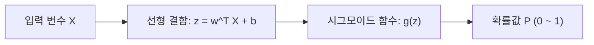

# 머신러닝 강의 요약 - 2026년 3월 18일

본 강의에서는 머신러닝의 기초 개념인 **분류(Classification)와 회귀(Regression)**의 구분, 대표적인 이진 분류 알고리즘인 **로지스틱 회귀(Logistic Regression)**의 수학적 유도 과정과 비용 함수, 그리고 모델 평가를 위한 **혼동 행렬(Confusion Matrix)** 및 주요 성능 지표(정확도, 정밀도, 민감도, F1-Score, ROC-AUC)에 대하여 학습했습니다.

---

## 1. 분류(Classification)와 회귀(Regression)의 기본 개념

머신러닝 예측 모델은 출력 변수(종속 변수)의 형태에 따라 크게 분류와 회귀로 나뉩니다. 모든 예측 모델은 성능을 정량적으로 평가할 수 있는 지표가 정의되어야 합니다.

| 구분 | 설명 | 대표 성능 평가 지표 | 예시 |
| :--- | :--- | :--- | :--- |
| **회귀 (Regression)** | 연속적인 실수 값을 예측하는 태스크 | MSE, RMSE, MAE, $R^2$ Score | 주가 예측, 기온 예측, 매출 예측 |
| **분류 (Classification)** | 이산적인 카테고리(클래스) 중 하나를 예측하는 태스크 | 정확도, 정밀도, 민감도, F1-Score, ROC-AUC | 스팸 메일 분류, 대학 합격 여부 예측, 환자 질병 유무 판정 |

---

## 2. 로지스틱 회귀 (Logistic Regression)의 수학적 유도

로지스틱 회귀는 이름에 '회귀'가 들어가지만, 실제로는 **이진 분류(Binary Classification)** 문제를 해결하는 대표적인 알고리즘입니다. 선형 회귀의 예측값($w^T x + b$)은 $-\infty$부터 $+\infty$까지의 무한한 범위를 가지므로, 이를 $0$과 $1$ 사이의 **확률(Probability)** 범위로 압축하는 과정이 필요합니다.

### 1) 오즈 (Odds)와 로짓 (Logit) 변환
*   **오즈 (Odds)**: 어떤 사건이 일어날 확률 $p$와 일어나지 않을 확률 $1-p$의 비율입니다.
    
    $$\text{Odds} = \frac{p}{1-p}$$

*   **로짓 함수 (Logit Function)**: 오즈에 자연로그를 취한 것으로, 입력 확률값 $p \in [0, 1]$을 실수 전체 범위 $(-\infty, \infty)$로 매핑합니다. 이 값을 선형 회귀식과 동일하게 둡니다.
    
    $$\ln\left(\frac{p}{1-p}\right) = w^T x + b$$

### 2) 시그모이드 함수 (Sigmoid Function)의 유도
위의 로짓 방정식을 확률 $p$에 대해 정리하면 시그모이드 함수(로지스틱 함수)가 도출됩니다.

1.  양변에 자연상수 $e$를 밑으로 하는 지수를 취합니다.
    
    $$\frac{p}{1-p} = e^{w^T x + b}$$

2.  방정식을 $p$에 대해 전개합니다.
    
    $$p = (1-p)e^{w^T x + b}$$
    $$p(1 + e^{w^T x + b}) = e^{w^T x + b}$$
    $$p = \frac{e^{w^T x + b}}{1 + e^{w^T x + b}}$$

3.  분모와 분자를 $e^{w^T x + b}$로 나누어 주면 최종 시그모이드 형태가 완성됩니다.
    
    $$p = \frac{1}{1 + e^{-(w^T x + b)}}$$

이 시그모이드 함수는 임의의 실수 입력값 $z$를 $0$과 $1$ 사이의 값으로 수렴시켜 이진 분류의 확률 예측값으로 활용할 수 있게 합니다.

---

## 3. 비용 함수 (Cost Function)와 경사 하강법 (Gradient Descent)

로지스틱 회귀 모델을 학습시킨다는 것은 최적의 가중치($w$)와 편향($b$) 파라미터를 찾는 과정입니다.

### 1) 이진 크로스 엔트로피 손실 함수 (Binary Cross Entropy Loss)
선형 회귀의 평균제곱오차(MSE)를 시그모이드 함수에 적용하면 손실 함수가 비볼록(Non-convex) 형태가 되어 로컬 미니마(Local Minima)에 빠지기 쉽습니다. 따라서 볼록(Convex) 형태를 보장하는 로그 손실 함수를 정의하여 사용합니다.

$$\text{Cost}(h_w(x), y) = \begin{cases} -\ln(h_w(x)) & \text{if } y = 1 \\ -\ln(1 - h_w(x)) & \text{if } y = 0 \end{cases}$$

전체 데이터 세트 $m$개에 대한 평균 비용 함수 $J(w)$는 다음과 같이 단일 수식으로 합쳐서 표현할 수 있습니다.

$$J(w) = -\frac{1}{m} \sum_{i=1}^m \left[ y^{(i)} \ln(h_w(x^{(i)})) + (1 - y^{(i)}) \ln(1 - h_w(x^{(i)})) \right]$$

### 2) 경사 하강법 (Gradient Descent)
이 비용 함수 $J(w)$를 최소화하기 위해, 매 반복마다 가중치 파라미터에 대해 미분을 수행하여 기울기(Gradient)의 반대 방향으로 파라미터를 점진적으로 업데이트합니다.

$$w_j \leftarrow w_j - \alpha \frac{\partial J(w)}{\partial w_j}$$

---

## 4. 분류 모델의 성능 평가 지표

불균형한 데이터셋(예: 정상 데이터 99%, 고장 데이터 1%)에서는 정확도 지표 하나만으로 모델의 성능을 판단할 수 없습니다. 따라서 정밀도, 민감도 등을 종합적으로 활용해야 합니다.

### 1) 혼동 행렬 (Confusion Matrix)

| | 예측값: Positive (1) | 예측값: Negative (0) |
| :---: | :---: | :---: |
| **실제값: Positive (1)** | **TP (True Positive)**   실제 1을 1로 정확히 예측 | **FN (False Negative)**   실제 1을 0으로 잘못 예측 (Type II Error) |
| **실제값: Negative (0)** | **FP (False Positive)**   실제 0을 1로 잘못 예측 (Type I Error) | **TN (True Negative)**   실제 0을 0으로 정확히 예측 |

### 2) 4대 성능 평가 지표 수식
*   **정확도 (Accuracy)**: 전체 데이터 중 올바르게 분류된 데이터의 비율입니다.
    
    $$\text{Accuracy} = \frac{TP + TN}{TP + TN + FP + FN}$$

*   **정밀도 (Precision)**: 모델이 1(Positive)이라고 예측한 것 중에서 실제 1인 것의 비율입니다.
    
    $$\text{Precision} = \frac{TP}{TP + FP}$$

*   **민감도 (Sensitivity) / 재현율 (Recall)**: 실제 1(Positive)인 데이터 중 모델이 1이라고 맞춘 비율입니다.
    
    $$\text{Recall} = \frac{TP}{TP + FN}$$

*   **F1-Score**: 정밀도와 민감도의 조화 평균으로, 데이터의 클래스 불균형이 심할 때 모델 성능을 효과적으로 나타냅니다.
    
    $$F1 = 2 \cdot \frac{\text{Precision} \cdot \text{Recall}}{\text{Precision} + \text{Recall}}$$

### 3) ROC 곡선 (Receiver Operating Characteristic) & AUC
*   **ROC 곡선**: 임계값(Threshold)을 0에서 1까지 변화시키면서, 거짓 양성 비율(FPR, 1-특이도) 대비 진짜 양성 비율(TPR, 민감도)의 궤적을 그린 그래프입니다.
*   **AUC (Area Under Curve)**: ROC 곡선 아래의 면적을 나타내며, 1.0에 가까울수록 분류 성능이 뛰어난 모델임을 의미합니다.
*   **임계값(Threshold) 튜닝**: 모델의 원 출력값은 확률이므로, 현업 조건에 맞추어 임계값을 임의로 설정하여(예: 0.5가 아닌 0.7로 조절) 정밀도와 민감도 간의 트레이드오프를 조율합니다.
