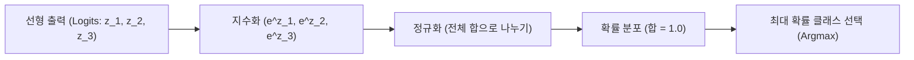

# 머신러닝 강의 요약 - 2026년 3월 25일

본 강의에서는 지난 이진 분류(Binary Classification)에 이어 다중 클래스 분류를 해결하기 위한 **소프트맥스 함수(Softmax Function)**의 개념과 동작 원리, 그리고 회귀(Regression)의 기본이 되는 **선형 회귀(Linear Regression)** 모델과 평균제곱오차(MSE) 비용 함수에 대하여 학습했습니다.

---

## 1. 다중 클래스 분류와 소프트맥스 함수 (Softmax)

현실 세계에서는 두 가지 상태(0 또는 1)를 구분하는 이진 분류뿐만 아니라, 세 개 이상의 카테고리 중 하나를 고르는 **다중 클래스 분류(Multi-class Classification)** 문제가 더 많이 발생합니다.

### 1) 개념 구분: 다중 클래스 vs. 다중 레이블
*   **다중 클래스 분류 (Multi-class Classification)**: 여러 상호 배타적인 클래스 중 단 **하나**를 고르는 문제 (예: 손글씨 숫자 0~9 중 하나 분류).
*   **다중 레이블 분류 (Multi-label Classification)**: 하나의 데이터가 동시에 **여러 개**의 클래스에 속할 수 있는 문제 (예: 한 사람이 가수이자 배우인 경우).

### 2) 소프트맥스 함수의 필요성
이진 분류용 시그모이드 함수를 각 클래스에 독립적으로 대입하여 다중 클래스 분류에 적용하면, 출력값들의 합이 $1$을 초과하게 되어 확률 공리를 위반하게 됩니다 (예: A확률 0.5, B확률 0.3, C확률 0.4인 경우 합이 1.2가 됨).
**소프트맥스 함수(Softmax)**는 각 클래스의 예측 결과값(Logits, $z$)에 지수 함수를 취한 뒤, 이를 모두 더한 값으로 나누어 **정규화(Normalization)**함으로써 최종 출력값들의 합이 항상 **정확히 1**이 되도록 만듭니다.

$$P(y=i \mid x) = \frac{e^{z_i}}{\sum_{j=1}^K e^{z_j}}$$

*   **동작 매커니즘**:
    1.  각 클래스에 대한 선형 예측값 $z_j = w_j^T x + b_j$를 구합니다.
    2.  모든 $z_j$에 자연상수 지수($e^{z_j}$)를 취하여 양수로 변환합니다. (음수 예측값도 양수로 양전)
    3.  이를 전체 합으로 나누어 확률 분포 형태로 변환합니다. 최종적으로 확률이 가장 높은 클래스를 예측값으로 선택합니다.

---

## 2. 시그모이드(Sigmoid) vs. 소프트맥스(Softmax) 비교

| 구분 | 시그모이드 함수 (Sigmoid) | 소프트맥스 함수 (Softmax) |
| :--- | :--- | :--- |
| **적용 범위** | 이진 분류 (Binary) | 다중 클래스 분류 (Multi-class) |
| **출력 노드 수** | $1$개 | 클래스 개수 $K$개 |
| **출력값 성질** | $0 \sim 1$ 사이의 단일 확률값 | $K$개 출력값의 합이 항상 $1$로 정규화됨 |
| **용도** | 로지스틱 회귀, 인공신경망의 이진 게이트 | 다중 로지스틱 회귀, 딥러닝 출력층의 다중 분류기 |

---

## 3. 손실 함수와 최적화 기법

### 1) 교차 엔트로피 손실 함수 (Cross-Entropy Loss)
다중 분류 모델에서는 실제 라벨(원-핫 인코딩 형태)과 모델이 예측한 확률 분포 간의 거리를 계산하기 위해 교차 엔트로피 손실 함수를 사용합니다.

$$J(W) = -\sum_{i=1}^K y_i \ln(P(y=i \mid x))$$

### 2) 최대 우도 추정법 (Maximum Likelihood Estimation, MLE)
모델이 예측하는 정답 클래스의 확률 분포를 최대화하는 파라미터 $W$를 찾는 최대 우도 추정법(MLE)은 수학적으로 교차 엔트로피 손실 함수를 최소화하는 문제와 완전히 동일합니다.

---

## 4. 선형 회귀 (Linear Regression)의 개념

선형 회귀는 독립변수 $x$와 종속변수 $y$ 간의 선형적인 상관관계를 모델링하여, 새로운 입력값에 대한 연속적인 수치를 예측하는 기법입니다.

### 1) 선형 회귀 모델 방정식 (가설 함수)
가중치(Weight, $w$)와 편향(Bias, $b$)을 파라미터로 하여 직선 형태의 가설 함수를 정의합니다.

$$h_w(x) = w^T x + b \quad (y = w_1 x_1 + w_2 x_2 + \dots + b)$$

### 2) 비용 함수: 평균제곱오차 (Mean Squared Error, MSE)
모델이 예측한 값($h_w(x)$)과 실제 데이터 값($y$) 간의 차이(잔차)를 제곱하여 평균한 값입니다. 오차가 작을수록 모델의 예측선이 데이터의 실제 분포를 잘 모사한 것입니다.

$$\text{MSE}(w) = \frac{1}{2m} \sum_{i=1}^m (h_w(x^{(i)}) - y^{(i)})^2$$

---

## 5. 머신러닝의 3대 핵심 시나리오 파이프라인

모든 머신러닝 문제 해결은 다음 3단계 프로세스의 반복으로 정의됩니다.

1.  **가설 함수(Hypothesis) 정의**: 예측을 위한 수학적 형태 설정 (예: 선형식, 시그모이드, 소프트맥스).
2.  **비용 함수(Cost Function) 평가**: 예측치가 실제와 얼마나 다른지 수치화 (예: MSE, 크로스 엔트로피).
3.  **최적화(Optimization)**: 비용 함수가 최소가 되도록 가중치 파라미터를 반복적으로 수정하는 학습 진행 (예: 경사 하강법).
