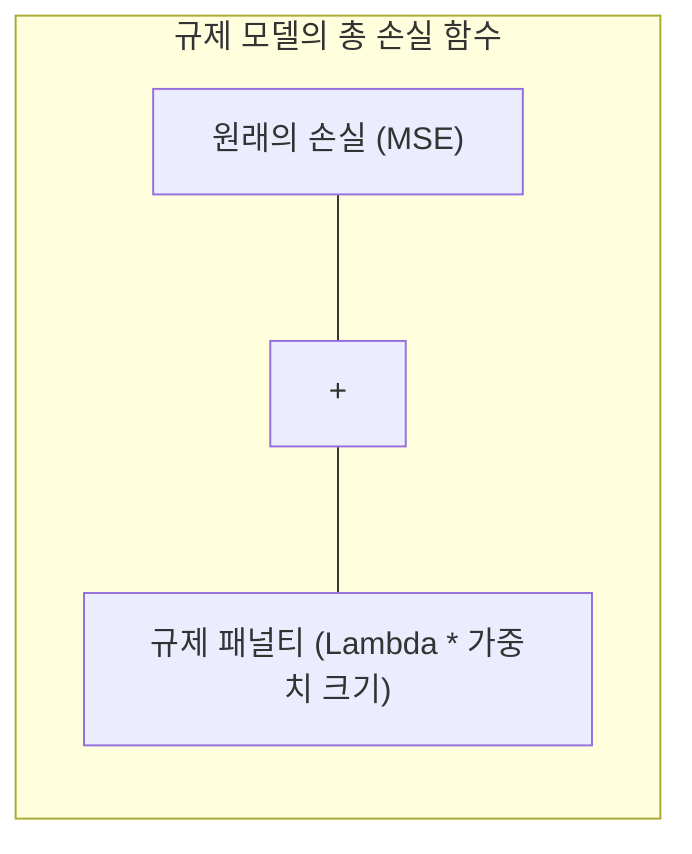

# 머신러닝 강의 요약 - 2026년 4월 1일

본 강의에서는 최적의 회귀 계수를 도출하기 위한 **최소 자승법(OLS)**과 **경사 하강법(Gradient Descent)**의 비교 분석, 경사 하강법의 세 가지 변형 기법, 그리고 회귀 모델의 4대 성능 지표와 함께 과대적합(Overfitting)을 극복하기 위한 **L1/L2 규제(Ridge, Lasso)**의 수학적 원리를 학습했습니다.

---

## 1. 선형 회귀 최적화 방법론 비교: 최소 자승법 vs. 경사 하강법

가설 함수 $y = w_1 x + w_0$의 최적 파라미터를 찾기 위해 크게 해석적 기법과 수치적 기법을 사용할 수 있습니다.

### 1) 최소 자승법 (Ordinary Least Squares, OLS)
*   **개념**: 손실 함수(MSE)를 회귀 계수 $w_0, w_1$에 대해 각각 편미분한 식을 $0$으로 두고 정규 방정식(Normal Equation)을 통해 한 번에 최적해를 연산하는 대수적 기법입니다.
*   **행렬 공식**:
    
    $$w = (X^T X)^{-1} X^T Y$$

    *(여기서 $X$ 행렬의 첫 번째 열은 편향 $w_0$을 반영하기 위해 모든 원소를 $1$로 고정한 상수 열(Bias Column)을 삽입하여 연산합니다.)*
*   **장단점**: 
    *   학습률 등 개발자가 조율해야 하는 **하이퍼파라미터(Hyperparameter)**가 필요 없습니다.
    *   데이터 수가 적을 때 매우 빠릅니다.
    *   하지만 데이터 변수(Feature) 수가 많아지면 역행렬 $(X^T X)^{-1}$ 연산 시 차원의 저주로 인해 엄청난 메모리가 발생하여 시스템 오버플로우가 생기는 한계가 있습니다.

### 2) 경사 하강법 (Gradient Descent)
*   **개념**: OLS와 달리 가중치 파라미터를 점진적으로 수정하며 비용 함수의 기울기(Gradient)가 0인 지점으로 수치적 탐색을 수행하는 기법입니다.
*   **학습률 ($\alpha$)**: 가중치 업데이트 시 발산하지 않고 최소치로 수렴하게 이끄는 대표적인 하이퍼파라미터로, 보폭이 너무 크면 최적해를 지나쳐 발산하고, 너무 작으면 연산 속도가 극단적으로 느려집니다.

---

## 2. 경사 하강법의 3대 변형 기법 비교

| 구분 | 전체 배치 경사 하강법 (BGD) | 확률적 경사 하강법 (SGD) | 미니 배치 경사 하강법 (MBGD) |
| :--- | :--- | :--- | :--- |
| **정의** | 전체 데이터를 모두 계산한 후 1 step 업데이트 | 임의로 섞은(Shuffle) 데이터 중 단 1개씩 계산 후 업데이트 | 전체 데이터를 소그룹(배치 사이즈)으로 쪼개어 업데이트 |
| **업데이트 속도** | 매우 느림 | 매우 빠름 | 빠르고 효율적 |
| **손실 수렴 곡선** | 안정적이며 매끄러움 | 노이즈(요동 현상)가 매우 큼 | 적정한 완충 하에 안정적으로 수렴 |
| **로컬 미니마 극복** | 빠져나오기 어려움 | 요동 현상으로 탈출 용이 | 적당한 노이즈로 탈출 가능 |
| **메모리 효율** | 데이터가 크면 메모리 초과 발생 | 극도로 적은 메모리 점유 | GPU 하드웨어 가속(병렬화)에 최적화 |
| **비고** | 전통적 접근 방식 | 불안정한 단점 존재 | **현대 딥러닝의 표준(Standard)** |

---

## 3. 회귀 모델의 4대 성능 평가 지표

연속 변수 예측의 오차를 판단하는 주요 지표들입니다.

*   **MAE (Mean Absolute Error, 평균 절대 오차)**:
    오차의 절댓값 평균입니다. 이상치(Outlier)에 덜 민감하여 왜곡을 방지합니다.
    
    $$\text{MAE} = \frac{1}{m} \sum_{i=1}^m \left| y^{(i)} - \hat{y}^{(i)} \right|$$

*   **MSE (Mean Squared Error, 평균 제곱 오차)**:
    오차의 제곱 평균입니다. 오차가 클수록 제곱으로 인해 페널티가 커지므로, 이상치에 매우 민감하게 대응하며 미분이 용이하여 학습 알고리즘 내부 표준 손실로 사용됩니다.
    
    $$\text{MSE} = \frac{1}{m} \sum_{i=1}^m (y^{(i)} - \hat{y}^{(i)})^2$$

*   **RMSE (Root Mean Squared Error)**:
    MSE에 루트를 씌워 단위 크기를 실제 예측 타깃과 일치시켜 직관적인 해석을 돕습니다.
    
    $$\text{RMSE} = \sqrt{\text{MSE}}$$

*   **결정 계수 ($R^2$ Score)**:
    모델이 데이터 분산을 얼마나 잘 예측하는가에 대한 지표로, $1.0$에 가까울수록 성능이 우수합니다.
    
    $$R^2 = 1 - \frac{\sum (y^{(i)} - \hat{y}^{(i)})^2}{\sum (y^{(i)} - \bar{y})^2}$$

---

## 4. 편향-분산 트레이드오프와 정규화 규제 (Regularization)

과대적합(Overfitting) 상태는 **높은 분산(High Variance)**과 낮은 편향(Low Bias)을 보입니다. 이를 억제하기 위해 손실 함수에 가중치 크기에 대한 페널티 항목을 더하는 규제를 적용합니다.

### 1) L2 규제: 릿지 회귀 (Ridge Regression)
가중치들의 제곱합을 손실 함수에 추가하여, 회귀 계수들의 절댓값을 전체적으로 작고 부드럽게 유지시킵니다.

$$J(w) = \text{MSE}(w) + \lambda \sum_{j=1}^n w_j^2$$

*   **기하학적 해석**: 가중치가 2차원 원형 경계선 안에 놓이도록 구속하여 가중치가 극단적으로 커지는 것을 억제합니다. 가중치를 완전 0으로 만들지는 않습니다.

### 2) L1 규제: 라쏘 회귀 (Lasso Regression)
가중치들의 절댓값의 합을 손실 함수에 추가합니다.

$$J(w) = \text{MSE}(w) + \lambda \sum_{j=1}^n |w_j|$$

*   **기하학적 해석**: 가중치 구속 조건이 마름모(다면체) 형태의 경계를 가집니다. 따라서 최적점을 만날 때 축(Corner) 상에서 만날 확률이 높아져 일부 영향력이 적은 가중치를 **정확히 0**으로 만듭니다. 이를 통해 **특성 선택(Feature Selection)** 효과를 유도하여 모델을 단순화(Sparse Model)합니다.
