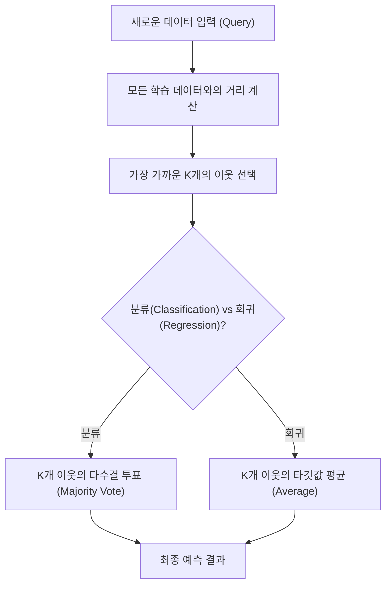

# 머신러닝 강의 요약 - 2026년 4월 8일

본 강의에서는 모델을 사전에 학습하지 않고 데이터 분석 시점에 예측을 수행하는 **사례 기반 학습(Instance-Based Learning)**의 대표 모델인 **K-최근접 이웃(K-Nearest Neighbors, KNN)** 알고리즘의 작동 원리(분류 및 회귀), 거리 측정 기법(유클리드, 맨해튼), 하이퍼파라미터 $k$에 따른 모델 성능 변화, 그리고 **시계열 데이터(Time-Series Data)**의 전처리 방법(정상성 확보)에 대하여 학습했습니다.

---

## 1. 사례 기반 학습 (Instance-Based Learning)과 KNN

전통적인 머신러닝 모델은 학습 데이터로 모델의 관계식(예: $f(x) = wx + b$)을 도출한 뒤 학습 데이터를 버리고 관계식만으로 추론을 수행합니다. 
반면, **사례 기반 학습(또는 게으른 학습, Lazy Learning)**은 사전 학습 단계를 거치지 않고, 예측 요청(Query)이 들어올 때마다 저장된 모든 학습 데이터와의 거리를 계산하여 즉석에서 결과를 도출합니다.

### 1) K-최근접 이웃 (KNN) 알고리즘 정의
새로운 데이터가 입력되었을 때, 기존 학습 데이터셋 중 가장 유사한(가장 가까운) $K$개의 이웃 데이터를 찾고, 이웃들의 정답(라벨) 분포에 근거하여 예측을 수행하는 **지도 학습** 알고리즘입니다.

*   **분류 (Classification)**: 가장 가까운 $K$개 이웃의 클래스 중 **다수결(Majority Vote)**로 최종 클래스를 결정합니다. 동점을 방지하기 위해 $K$값은 일반적으로 **홀수**로 설정합니다.
*   **회귀 (Regression)**: 가장 가까운 $K$개 이웃의 목표 변수(Target) 값들의 **평균(Average)**을 취하여 예측값으로 지정합니다.

---

## 2. 거리 측정 기법 (Distance Metrics)

데이터 간의 '유사도'를 정의하기 위해 두 데이터 포인트 사이의 거리를 측정해야 합니다. 주로 **유클리드 거리**와 **맨해튼 거리**가 사용됩니다.

### 1) 유클리드 거리 (Euclidean Distance)
*   **개념**: 두 포인트 사이의 가장 짧은 직선거리(최단거리)로, 피타고라스 정리의 확장형입니다. 일반적으로 KNN에서 디폴트로 사용하는 방식입니다.
*   **공식** (2차원 공간 상의 두 점 $p(p_1, p_2)$와 $q(q_1, q_2)$):
    
    $$d(p, q) = \sqrt{(p_1 - q_1)^2 + (p_2 - q_2)^2}$$

### 2) 맨해튼 거리 (Manhattan Distance / L1 Distance)
*   **개념**: 바둑판 모양의 도로망을 가진 맨해튼 도시에서 건물을 피해 가듯 격자식 도로를 따라 이동할 때의 거리입니다. 꺾인 선들의 길이 합입니다.
*   **공식**:
    
    $$d(p, q) = |p_1 - q_1| + |p_2 - q_2|$$

---

## 3. 하이퍼파라미터 $k$ 설정에 따른 성능 변화

개발자가 조율하는 하이퍼파라미터인 $k$의 크기는 모델의 복잡도와 성능에 절대적인 영향을 미치며, 편향-분산 트레이드오프(Bias-Variance Trade-off)가 발생합니다.

*   **$k$가 너무 작은 경우 (예: $k=1$)**:
    *   극단적으로 가까운 하나의 데이터에만 의존하므로 결정 경계(Decision Boundary)가 매우 구불구불해지고 노이즈(이상치)에 민감해집니다.
    *   **과대적합(Overfitting)** 상태를 유발하며, 분산이 높고(High Variance) 편향이 낮아집니다.
*   **$k$가 너무 큰 경우 (예: $k=N$)**:
    *   넓은 범위의 데이터 성격을 포함하게 되므로 결정 경계가 매우 완만하고 뭉툭해집니다.
    *   **과소적합(Underfitting)** 상태를 유발하며, 편향이 높고(High Bias) 분산이 낮아집니다. (극단적으로 $k$가 데이터 전체 개수와 같아지면 데이터 내에서 가장 다수인 클래스로만 무조건 예측하는 단순한 모델이 됨)

---

## 4. 스마트 팩토리와 시계열 데이터 (Time-Series Data) 전처리

제조 현장에서 센서를 통해 실시간으로 수집되는 데이터는 시간에 따라 변하는 **시계열 데이터**의 성격을 갖습니다.

### 1) 시계열 데이터의 4대 구성 요소
1.  **추세 (Trend)**: 장기적으로 증가하거나 감소하는 큰 흐름.
2.  **계절성 (Seasonality)**: 특정 주기(하루, 일주일, 일년 등)에 따라 주기적으로 반복되는 패턴.
3.  **순환성 (Cyclicality)**: 경기 변동과 같이 일정하지 않은 주기로 위아래로 출렁이는 장기적 변화.
4.  **불규칙 요인/노이즈 (Random/Noise)**: 돌발적인 요인으로 발생하는 임의의 불규칙한 미세 진동.

### 2) 정상성 (Stationarity) 확보 및 전처리 방법
대부분의 전통적 시계열 모델(ARIMA 등)은 시계열 데이터가 시간에 따라 통계적 특성이 변하지 않는 **정상 시계열**일 때 예측력이 높습니다. 정상성을 확보하기 위한 전처리 기법은 다음과 같습니다.

*   **평균의 안정화 (차분, Differencing)**: 현재 시점의 값에서 이전 시점의 값을 빼주는 차분 처리를 통해 우상향/우하향하는 장기적 **추세(Trend)**를 제거하여 평균을 일정하게 만듭니다.
*   **분산의 안정화 (로그 변환, Log Transform)**: 시간에 따라 진폭(분산)이 점점 커지는 현상이 있을 때, 로그를 취해 데이터를 압축하여 진폭을 일정하게 맞춥니다.
