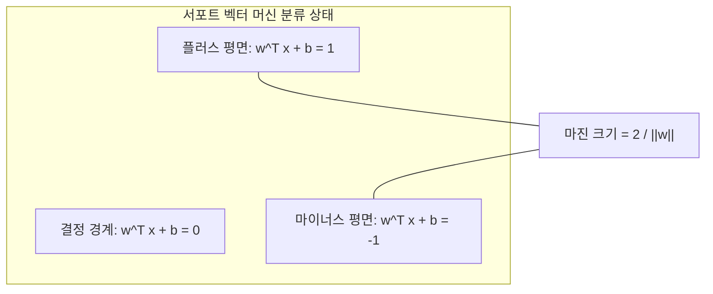

# 머신러닝 강의 요약 - 2026년 4월 22일

본 강의에서는 대표적인 강건한 분류 알고리즘인 **서포트 벡터 머신(Support Vector Machine, SVM)**의 수학적 모델링과 동작 원리, 최적의 결정 경계를 구하기 위한 **라그랑주 쌍대성(Lagrange Duality)** 유도, 오차를 허용하는 **소프트 마진(Soft Margin)** 설계, 그리고 고차원 공간 매핑을 위한 **커널 기법(Kernel Trick)**에 대해 학습했습니다.

---

## 1. 서포트 벡터 머신(SVM)의 핵심 개념과 마진(Margin)

SVM은 두 클래스의 데이터를 가장 잘 분리하는 **결정 초평면(Decision Hyperplane)**을 찾는 것을 목표로 합니다.

*   **서포트 벡터 (Support Vectors)**: 결정 경계와 가장 가까이에 위치하여 마진의 한계선을 결정하는 학습 데이터 포인트들입니다. 이 점들이 모델을 전적으로 지탱합니다.
*   **마진 (Margin)**: 결정 경계(초평면)로부터 양쪽 클래스의 서포트 벡터에 이르는 최단 직선거리입니다.
*   **일반화 성능 극대화**: SVM의 목적은 이 마진을 최대화(Maximize)하는 것이며, 마진이 넓을수록 새로운 테스트 데이터가 입력되었을 때의 일반화 예측 능력이 우수해집니다.



---

## 2. 하드 마진 SVM의 수학적 모델링

모든 학습 데이터를 오차 없이 완벽하게 선형 분리할 수 있다는 가정을 하는 **하드 마진(Hard Margin)** 상황의 최적화 유도식입니다.

### 1) 목적 함수 정의
*   결정 경계면 식: $w^T x + b = 0$ (여기서 $w$는 법선 벡터, $b$는 편향)
*   마진 크기는 $\frac{2}{\|w\|_2}$로 정의되며, 이를 최대화하는 것은 분모인 가중치 크기($\|w\|_2$)를 최소화하는 것과 같습니다. 수학적으로 미분이 용이하게 역수의 제곱 형태로 최적화 문제를 설계합니다.
    
    $$\min_{w, b} \quad \frac{1}{2} \|w\|_2^2$$

### 2) 제약 조건 (Constraints)
모든 양수 데이터(라벨 $y^{(i)} = 1$)는 결정 경계선보다 위에, 음수 데이터(라벨 $y^{(i)} = -1$)는 아래에 위치해야 하므로 단일 조건식으로 결합합니다.

$$y^{(i)} (w^T x^{(i)} + b) \ge 1 \quad \forall i = 1, \dots, m$$

---

## 3. 라그랑주 승수법과 쌍대성 (Duality)

위의 제약 조건이 있는 볼록(Convex) 최적화 문제를 풀기 위해 라그랑주 승수(Lagrange Multiplier) $\alpha_i \ge 0$를 도입합니다.

### 1) 라그랑주 함수
$$\mathcal{L}(w, b, \alpha) = \frac{1}{2} \|w\|_2^2 - \sum_{i=1}^m \alpha_i \left[ y^{(i)} (w^T x^{(i)} + b) - 1 \right]$$

### 2) 편미분을 통한 변수 소거
Primal 변수인 $w$와 $b$에 대해 각각 편미분을 수행하여 $0$이 되는 지점을 구합니다.
*   $\frac{\partial \mathcal{L}}{\partial w} = 0 \implies w = \sum_{i=1}^m \alpha_i y^{(i)} x^{(i)}$
*   $\frac{\partial \mathcal{L}}{\partial b} = 0 \implies \sum_{i=1}^m \alpha_i y^{(i)} = 0$

위 조건을 원래의 라그랑주 함수에 대입하면, 가중치 $w$와 $b$가 소거되고 라그랑주 승수 $\alpha$와 입력 피처 벡터 간의 **내적(Dot Product)**으로만 표현되는 **쌍대 문제(Dual Problem)**로 전환됩니다.

$$\max_{\alpha} \quad \sum_{i=1}^m \alpha_i - \frac{1}{2} \sum_{i=1}^m \sum_{j=1}^m \alpha_i \alpha_j y^{(i)} y^{(j)} (x^{(i)} \cdot x^{(j)})$$

이 쌍대 문제를 풀면 최적의 $\alpha_i$를 구할 수 있으며, KKT(Karush-Kuhn-Tucker) 조건에 따라 $\alpha_i > 0$인 데이터 포인트들만이 **서포트 벡터**로 결정 경계 계산에 관여합니다. 나머지 데이터 포인트들은 $\alpha_i = 0$이 되어 모델에 영향을 주지 않습니다.

---

## 4. 소프트 마진 (Soft Margin)과 슬랙 변수 ($\xi$)

현실 세계의 데이터는 대부분 노이즈가 섞여 있어 완벽한 선형 분리가 불가능하거나, 하드 마진을 강제하면 과대적합이 유발됩니다. 이를 보완하기 위해 약간의 오차를 허용하는 **슬랙 변수(Slack Variable, $\xi_i \ge 0$)**를 도입합니다.

### 1) 소프트 마진 목적 함수
$$\min_{w, b, \xi} \quad \frac{1}{2} \|w\|_2^2 + C \sum_{i=1}^m \xi_i \quad \text{s.t.} \quad y^{(i)} (w^T x^{(i)} + b) \ge 1 - \xi_i$$

### 2) 하이퍼파라미터 $C$의 성질 (정규화 트레이드오프)
*   **큰 $C$값 설정**: 오차 페널티를 매우 강하게 부여하므로, 학습 오류를 줄이기 위해 마진 폭을 좁히는 엄격한 기준을 적용합니다. (과대적합/Overfitting 위험 증가)
*   **작은 $C$값 설정**: 큰 오차들을 비교적 유연하게 허용하므로 마진 폭을 최대한 넓게 확보합니다. (과소적합/Underfitting 위험 증가)

---

## 5. 비선형 분류와 커널 기법 (Kernel Trick)

선형 분류가 불가능한 저차원의 데이터를 고차원(Feature Space)으로 매핑하여 선형 분리가 가능하도록 만드는 기법입니다.

```
[2차원 공간: 선형 분리 불가]           [고차원 공간 매핑: 평면으로 선형 분리 가능]
      o   x   o                                x   x   x
    o   x   x   o             ───>           o           o
      o   x   o                                o   o   o
```

### 1) 커널 함수의 원리
고차원 매핑 함수 $\Phi(x)$를 직접 정의하여 고차원 벡터를 계산하면 연산량이 기하급수적으로 늘어납니다. 대신, 고차원 공간 상의 내적을 저차원 입력 도메인에서 직접 연산할 수 있는 **커널 함수($K(x, y) = \Phi(x) \cdot \Phi(y)$)**를 대입하여 풀이함으로써 연산 속도를 대폭 단축시킵니다.

### 2) 대표적인 커널 종류
*   선형 커널 (Linear Kernel): $K(x, y) = x^T y$
*   다항식 커널 (Polynomial Kernel): $K(x, y) = (x^T y + c)^d$
*   **RBF/가우시안 커널 (Radial Basis Function)**:
    $K(x, y) = e^{-\gamma \|x - y\|^2}$ (가장 대중적이며 비선형성이 뛰어남)
