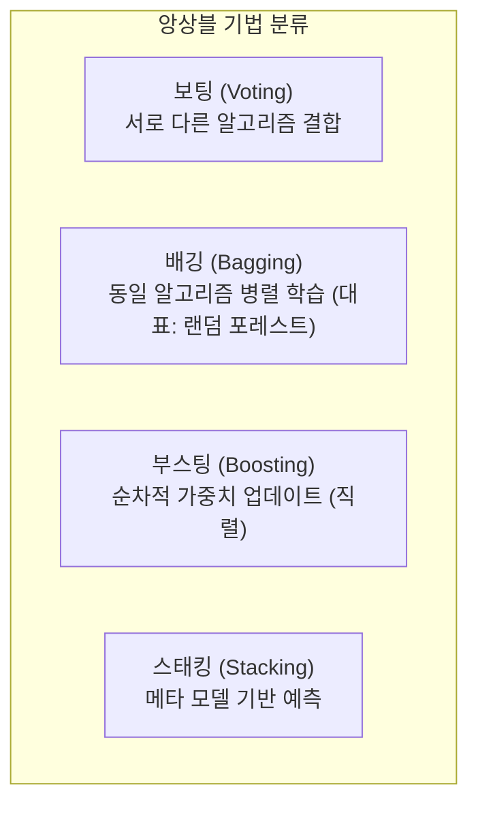

# 머신러닝 강의 요약 - 2026년 5월 6일

본 강의에서는 단일 모델의 한계를 극복하고 예측 성능을 극대화하기 위한 **앙상블 학습(Ensemble Learning)**의 4대 기본 유형(보팅, 배깅, 부스팅, 스태킹)과 대표적인 배깅 알고리즘인 **랜덤 포레스트(Random Forest)**의 수학적/통계적 작동 원리, 그리고 **변수 중요도(Feature Importance)** 산출 방법에 대해 학습했습니다.

---

## 1. 앙상블 학습 (Ensemble Learning)의 개념과 필요성

앙상블 학습은 **"여러 개의 약한 학습기(Weak Learner)를 결합하여 하나의 강한 학습기(Strong Learner)를 만드는 기법"**입니다.

*   **실무적 위상**: 실제 인공지능 경진대회(캐글 등)나 제조 현장에서 딥러닝을 적용하기 전, 정형 데이터 예측 성능을 극대화하기 위해 가장 널리 쓰이는 기법입니다.
*   **상충 관계 (Trade-off)**:
    *   **장점**: 단일 모델 대비 분산(Variance)과 편향(Bias)을 효과적으로 낮추어 예측 정확도를 향상시킵니다.
    *   **단점**: 여러 개의 모델을 생성하고 취합하므로 연산 비용이 크고 속도(Inference Time)가 느려집니다.

---

## 2. 앙상블 학습의 4대 기본 유형

### 1) 보팅 (Voting)
서로 다른 알고리즘(예: 로지스틱 회귀, Naive Bayes, KNN 등)을 동일한 데이터셋으로 학습시키고 결합합니다.
*   **하드 보팅 (Hard Voting)**: 각 모델의 예측 결과 중 다수결 투표를 통해 최종 클래스를 결정합니다.
*   **소프트 보팅 (Soft Voting)**: 각 모델이 출력하는 클래스별 확률값들의 평균을 구한 후, 가장 확률이 높은 클래스를 선택합니다. 일반적으로 하드 보팅보다 성능이 좋아 표준으로 사용됩니다.

### 2) 배깅 (Bagging, Bootstrap Aggregating)
동일한 모델(일반적으로 의사결정 트리)을 여러 개 생성하고, 데이터를 병렬적으로 나누어 학습시킵니다.
*   **동작 원리**: 원본 데이터에서 복원 추출(보건 추출)을 통해 가상의 데이터 서브셋(**부트스트랩**)을 만들어 각 모델을 독립적으로(병렬로) 학습시킵니다.
*   **Aggregating**: 분류는 다수결(또는 소프트 보팅), 회귀는 예측값들의 평균을 내어 최종 예측을 수행합니다.

### 3) 부스팅 (Boosting)
앞선 모델이 예측한 오류를 바탕으로, 다음 모델이 더 나은 예측을 할 수 있도록 가중치를 조정해가며 **순차적(직렬)**으로 학습을 진행합니다.
*   *특징*: 오차를 줄이는 성능은 배깅보다 우수하지만, 순차 학습을 해야 하므로 병렬 연산이 불가능하여 학습 시간이 오래 걸리고 노이즈가 많은 데이터에 대해 과대적합 위험이 있습니다.

### 4) 스태킹 (Stacking)
여러 베이스 모델의 예측값 자체를 새로운 데이터셋의 피처(Feature)로 구성하여, 최종 메타 학습기(Meta Learner)를 통해 한 번 더 학습하여 결합하는 고수준 앙상블 기법입니다.

---

## 3. 배깅(Bagging)의 수학적 기초: OOB (Out-of-Bag) 데이터

크기가 $N$인 원본 데이터셋에서 복원 추출로 $N$개의 샘플을 뽑는 부트스트랩 과정을 무한히 수행할 때, 특정 데이터 샘플이 한 번도 선택되지 않을 수학적 확률을 유도할 수 있습니다.

*   한 번의 드로우(Draw)에서 특정 샘플이 뽑히지 않을 확률은 $1 - \frac{1}{N}$ 입니다.
*   $N$번의 복원 추출 동안 한 번도 뽑히지 않을 확률은 다음과 같습니다.
    
    $$\lim_{N \to \infty} \left( 1 - \frac{1}{N} \right)^N = e^{-1} \approx 0.368 \quad (36.8\%)$$

즉, 평균적으로 학습 데이터의 약 **$36.8\%$**는 개별 트리 모델의 부트스트랩 샘플에 포함되지 않는 **OOB (Out-of-Bag) 데이터**가 됩니다. 이 oob 데이터를 활용하면 별도의 검증 데이터셋(Validation Set)을 분할하지 않고도 훈련 과정에서 내부 검증 점수를 매길 수 있습니다.

---

## 4. 랜덤 포레스트 (Random Forest)의 원리

랜덤 포레스트는 배깅(Bagging) 기법에 **특성 무작위성(Feature Randomness)**을 결합한 알고리즘입니다.

### 1) 무작위 하위 공간 기법 (Random Subspace)
개별 의사결정 트리를 구축할 때 모든 변수를 다 사용하면 트리들이 서로 강한 상관관계(Correlation)를 갖게 되어 앙상블 효과가 떨어집니다. 이를 방지하기 위해 노드를 분할할 때 무작위로 일부 변수군만 선택하여 탐색합니다.
*   **분류 문제 권장 변수 수**: $m = \sqrt{p}$ (여기서 $p$는 전체 피처 수)
*   **회귀 문제 권장 변수 수**: $m = \frac{p}{3}$

### 2) 변수 중요도 (Feature Importance) 측정 방식
모델 예측에 어떤 변수가 가장 결정적인 기여를 했는지 평가합니다.
1.  특정 변수 $X_j$의 중요도를 측정하기 위해, OOB 데이터셋에서 $X_j$의 값을 무작위로 뒤섞는(Permutation) 처리를 합니다.
2.  해당 피처값을 섞은 상태에서 모델의 OOB 에러를 다시 측정합니다.
3.  만약 중요도가 높은 변수가 섞였다면 모델의 오차율이 매우 크게 치솟을 것이고, 중요하지 않은 변수였다면 오차 변화가 미미할 것입니다. 이 오차 증가량(MSE 증가 혹은 지니 불순도 감소량)을 기준으로 변수 중요도를 도출합니다.
