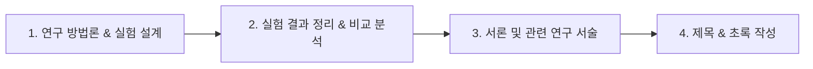
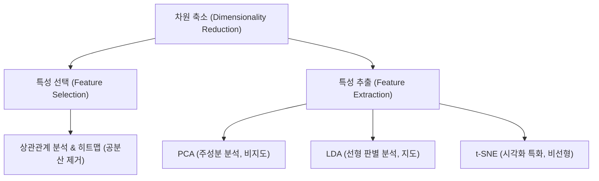

# 머신러닝 강의 요약 - 2026년 5월 13일

본 강의에서는 대학원 연구 과정에서 유용한 논문/특허 작성 노하우와 함께, 머신러닝에서 중요한 개념인 **차원의 저주(Curse of Dimensionality)**, 이를 극복하기 위한 **차원 축소(Dimensionality Reduction)**의 기법들(특성 선택 vs. 특성 추출), 그리고 주성분 분석(PCA), 선형 판별 분석(LDA), t-SNE의 핵심 동작 원리에 대해 학습했습니다.

---

## 1. 대학원 연구 가이드: 논문 및 특허 작성 프로세스

학습한 이론을 실무적으로 자산화하고 학술 성과를 내기 위한 가이드라인입니다.

### 1) 학술 논문 작성 순서
일반적인 논문 독서 순서(초록 -> 서론 -> 본론)와 달리, 논문을 작성할 때는 연구 결과가 확실히 정립된 시점부터 거꾸로 서술해 나가는 것이 효율적입니다.

*   **국내 저널 게재 팁**: 제조 현장의 독특한 센서 데이터셋을 사용하고, 논문을 통해 데이터셋을 오픈소스화하여 기여하겠다고 제시하는 경우 높은 확률로 심사를 통과합니다. (현장 실물 사진과 구체적인 성능 개선 도표 필수 수록)
*   **SOTA (State-Of-The-Art) 비교**: 제안하는 모델이 기존 업계 표준 최상위 모델들보다 우수함을 정량적으로 비교 검증해야 합니다.

### 2) 특허 출원
충북대학교 산학협력단 등의 지원 제도를 활용하여 아이디어 요약서(2~3페이지)를 작성하여 제출하면, 전담 변리사가 이를 보완하여 상세한 특허 명세서(약 20페이지 분량)로 발전시켜 대리 출원을 진행합니다.

---

## 2. 차원의 저주 (Curse of Dimensionality)

머신러닝 공간에서 **차원(Dimension)**은 데이터가 가지는 **특성(Feature, 피처, 변수, 열)**의 개수를 의미합니다.

*   **차원의 예시**: 
    *   $256 \times 256$ 크기의 흑백 이미지는 각 픽셀이 하나의 피처가 되므로 $65,536$차원의 데이터 공간에 위치합니다.
    *   컬러(RGB) 이미지의 경우 3채널이 되므로 $256 \times 256 \times 3 = 196,608$차원이 됩니다.
*   **차원의 저주**:
    피처 수가 기하급수적으로 늘어남에 따라 데이터가 존재하는 공간의 부피가 급격히 팽창하여 데이터 분포가 매우 희소(Sparse)해집니다. 이로 인해 거리를 기반으로 작동하는 머신러닝 알고리즘(KNN 등)의 오차가 왜곡되고, 노이즈가 과적합되어 성능이 하락하는 현상을 말합니다.
*   **차원 축소의 이점**:
    *   중요하지 않은 피처(노이즈) 제거를 통한 모델 예측 성능 향상
    *   학습 및 추론 연산의 메모리 사용량 절감 및 연산 가속화
    *   2차원 또는 3차원 공간으로의 매핑을 통한 시각적 데이터 분석 가능

---

## 3. 차원 축소 기법의 분류: 특성 선택 vs. 특성 추출

### 1) 특성 선택 (Feature Selection)
원본 변수 중 가장 유용한 변수 서브셋만을 선택하고 나머지는 완전 배제하는 방법입니다. 변수의 고유한 물리적 의미가 그대로 유지됩니다.
*   **히트맵(Heatmap) 공분산 분석**: 피처 간 상관관계가 너무 높은 항목들은 다중공선성 문제를 유발하므로, 공분산을 시각화한 히트맵 상에서 밀접도가 $1.0$에 가까운 항목 중 하나를 제거하여 단순화합니다.

### 2) 특성 추출 (Feature Extraction)
원본 변수들을 통째로 믹서기에 넣고 갈아 엎듯, 기존 피처들의 조합을 통해 완전히 새로운 저차원 공간의 피처 변수를 생성 및 압축하는 방법입니다.

---

## 4. 주요 특성 추출 알고리즘의 원리

### 1) PCA (주성분 분석, Principal Component Analysis)
*   **원리**: 데이터에 정답 라벨이 없을 때 사용하는 대표적인 **비지도 학습(Unsupervised)** 차원 축소 기법입니다. 데이터의 분산(Variance, 즉 정보의 양)이 가장 크게 퍼져 있는 축을 첫 번째 주성분($PC_1$)으로 설정하고, 이와 직교하는 축을 차례로 찾아 정투영(Orthogonal Projection)시킵니다.
*   **스크리 플롯 (Scree Plot)**:
    주성분 개수(PC 개수)에 따라 설명 가능한 누적 분산량의 변화를 시각화한 꺾은선 그래프입니다. 기울기가 급격히 완만해지는 엘보우(Elbow) 지점을 포착하여 적정 주성분 개수(주로 2개 혹은 3개)를 채택합니다.

### 2) LDA (선형 판별 분석, Linear Discriminant Analysis)
*   **원리**: 데이터의 클래스 정답 라벨 정보를 적극 활용하는 **지도 학습(Supervised)** 기반 차원 축소 기법입니다.
*   **목적**: 서로 다른 클래스 간의 중심 거리(Between-class Variance)는 최대화하고, 같은 클래스 내부의 분산(Within-class Variance)은 최소화하는 새로운 축을 찾아 데이터를 투영시킵니다. 분류 성능 극대화에 초점을 맞춥니다.

### 3) t-SNE (t-Distributed Stochastic Neighbor Embedding)
*   **원리**: 고차원 공간 상에 가깝게 이웃해 있는 데이터들의 지역적 구조(Local Structure)를 저차원 공간 상에서도 최대한 보존하도록 분포 형태(t-분포)로 변환하는 강력한 **비선형 시각화** 기법입니다.
*   **주 용도**: 고차원의 복잡한 데이터가 어떤 형태로 군집(Clustering)을 이루고 있는지 2차원 평면에 직관적으로 투영하여 분석하기 위해 사용됩니다.
