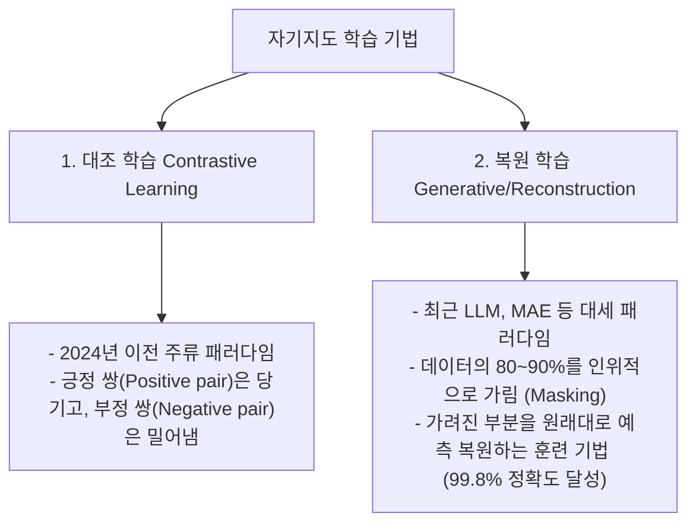

# 머신러닝 강의 요약 (2026-05-20)

## 1. 지도 학습과 비지도 학습 및 자기지도 학습(SSL) 트렌드

### 지도 학습 vs. 비지도 학습
*   **지도 학습 (Supervised Learning)**: 데이터와 이에 대응하는 라벨(정답)이 있는 데이터셋으로 학습 (예: 선형 회귀, KNN, SVM 등).
*   **비지도 학습 (Unsupervised Learning)**: 라벨링 비용이 크고 정답이 부재한 현장 데이터를 학습하기 위해 내재된 패턴, 군집, 상관관계를 파악하는 방식. 최근 머신러닝 트렌드의 핵심 축임.

### 자기지도 학습 (Self-Supervised Learning, SSL)의 진화
비지도 학습에서 출발하여 인공지능이 스스로 문제(라벨)를 정의하고 이를 해결하면서 학습하는 기법입니다.

---

## 2. 계층적 군집화 (Hierarchical Clustering)

유사한 데이터 포인트들을 연쇄적으로 묶어가며 트리 형태의 **덴드로그램(Dendrogram)**을 형성하는 분석 방식입니다.

### ① 응집형 (Agglomerative) vs. 분리형 (Divisive)
*   **응집형 (Bottom-Up)**: 개별 데이터 포인트를 각각 하나의 군집으로 설정하여 가장 유사한 군집끼리 아래에서부터 위로 병합해 나가는 방식 (실무 주류).
*   **분리형 (Top-Down)**: 전체 데이터를 하나의 거대한 군집으로 놓고 순차적으로 쪼개어 내려가는 방식. 파이썬 라이브러리에도 관련 함수가 전무할 정도로 **이론상으로만 존재하고 실무에는 쓰이지 않음**.
*   **덴드로그램과 의사결정 나무의 차이**:
    *   두 시각화 구조 모두 트리 형태를 띰.
    *   **의사결정 나무(Decision Tree)**는 지도 학습 계열로 위에서부터 아래로 분기해 나가는 탑다운(Top-down) 구조인 반면, **덴드로그램**은 아래에서 위로 묶어 올라가는 바텀업(Bottom-up) 구조임.

### ② 데이터 간의 거리 측정법 (Distance & Similarity Metrics)
컴퓨터가 유사도를 판단하도록 수치형과 범주형 데이터 특징에 맞춰 거리를 연산합니다.

*   **수치형 데이터 거리**:
    *   **유클리디안 거리 (Euclidean Distance)**: 피타고라스 정리에 기반한 2차원 공간 상의 최단 직선거리.
    *   **맨해튼 거리 (Manhattan Distance)**: 장애물을 우회해야 하는 도시 블록 형태처럼 축별 절대값 차이의 합으로 구하는 거리.
    *   **민코우스키 거리 (Minkowski)**: 매개변수 $p$의 차수에 따라 유클리디안과 맨해튼 거리를 일반화한 수학 모델.
    *   **마할라노비스 거리 (Mahalanobis)**: 데이터의 통계적 상관성과 공분산 구조를 고려한 정규화된 거리.
*   **범주형 데이터 유사도 (Similarity)**:
    *   **자카드 유사도 (Jaccard Similarity)**: 두 집합의 합집합 분의 교집합 비율을 측정.
    *   **코사인 유사도 (Cosine Similarity)**: 벡터의 길이를 배제하고 방향 사잇각의 Cosine 값만 측정. LLM 임베딩의 유사성 비교 및 ChatGPT 동작의 핵심 메커니즘으로 널리 사용됨 (1: 동일 방향, 0: 직교/무상관, -1: 정반대 방향).

### ③ 군집 간의 거리 측정법 (Linkage Methods)
*   **단일 연결법 (Single Linkage)**: 두 군집에 속한 관측치들 사이의 최솟값을 군집 거리로 채택.
*   **완전 연결법 (Complete Linkage)**: 두 군집에 속한 관측치들 사이의 최댓값을 군집 거리로 채택.
*   **평균 연결법 (Average Linkage)**: 모든 관측치 쌍 간 거리의 평균값을 채택.
*   **와드 연결법 (Ward's Linkage)**: 
    *   군집을 병합했을 때 발생하는 내부 **오차제곱합 (SSE: Sum of Squared Errors)**의 증가량이 최소가 되는 방식으로 병합을 결정.
    *   군집 내부의 응집성이 극대화되는 강력한 성질을 지녀 **현업 및 라이브러리 디폴트 링크 기법으로 가장 애용됨**.

---

## 3. 정량적 성능 평가 및 K 선정 기법

### 실루엣 계수 (Silhouette Coefficient)
군집화 결과 및 적정 군집 수 K의 유효성을 수치적으로 평가하는 척도입니다.

$$s(i) = \frac{b(i) - a(i)}{\max(a(i), b(i))}$$

*   **$a(i)$ (Cohesion, 응집도)**: 해당 데이터 포인트가 속한 군집 내 다른 모든 데이터들과의 평균 거리 (작을수록 좋음).
*   **$b(i)$ (Separation, 분리도)**: 해당 데이터 포인트에서 가장 인접한 다른 군집의 모든 데이터들과의 평균 거리 (클수록 좋음).
*   **범위**: **-1에서 +1 사이**의 값을 가지며, **1에 가까울수록 내부적으로 오밀조밀하게 뭉쳐있고 타 군집과는 완전히 경계가 확실하다는 완벽한 군집성**을 뜻함.

---

## 4. 비계층적 군집화 (Non-Hierarchical Clustering)

### ① K-Means (K-평균) 알고리즘 작동 4단계
1.  **중심점 초기화 (Initialization)**: 사전에 지정한 하이퍼파라미터 K개만큼의 임의의 중심점(Centroid)을 공간 상에 흩뿌림.
2.  **군집 할당 (Assignment)**: 각 데이터 포인트와 중심점들 간의 유클리디안 거리를 연산하여 가장 가까운 중심점 군집에 할당.
3.  **중심 이동 (Update)**: 각 군집 내부 데이터 포인트들의 물리적 평균값(Mean)을 구해 중심점을 해당 평균값 위치로 업데이트.
4.  **반복 종료 (Convergence)**: 중심점의 위치가 수렴하여 더 이상 변화가 없거나 제한된 반복 횟수를 채우면 최종 종료.

> [!WARNING]
> **K-Means의 3대 취약점**
> 1.  **초기 중심점 종속성**: 초기 K 위치를 무작위로 찍기 때문에 매 실행마다 지역 최적해(Local Optima)에 걸려 엉뚱한 결론이 날 수 있음. 이를 극복하기 위해 다수(100번 이상) 반복 테스트 후 SSE가 최소가 되는 모델을 취해야 함.
> 2.  **K 설정의 사전 강제**: 하이퍼파라미터 K를 사용자가 수동 지정해야 함 (Elbow Method 등을 통해 SSE 그래프가 꺾이는 지점을 최적 K로 사용).
> 3.  **기하학적 한계**: 오직 원형(구형) 분포 형태의 거리를 기준으로 묶어주므로 초승달 구조나 불규칙 밀도를 가진 데이터의 클러스터링에는 실패함.

### ② DBSCAN (Density-Based Spatial Clustering)
*   **밀도 기반 군집화**: 거리만을 계산하는 K-Means를 보완하기 위해, 데이터의 촘촘한 밀도(Density)를 계산해 불규칙한 형상의 군집도 추적해 냄.
*   **장점**: 하이퍼파라미터 K를 사전에 줄 필요가 없으며, 군집 밀도 요건을 불충족하는 외딴 데이터는 자동으로 "노이즈/이상치(Noise/Anomaly)"로 걸러주므로 제조 현장 이상탐지 분야에 유용함.

---

## 5. 교수 학술 팁 (학위 논문 심사 팁)

*   대학원 박사 학위 디펜스 심사 시, 복잡한 다차원 원계열 데이터를 2차원 공간 상에 가시화하여 논리를 전개하는 것이 필수적임.
*   학회 발표 및 논문 구성 시 전처리 차원축소 단계에서 **t-SNE (t-Distributed Stochastic Neighbor Embedding)**를 활용하여 시각화하고, 비지도 기반으로 군집 경계가 뚜렷이 나뉘는 패턴을 보여주면 설득력이 극대화되므로 관련 이론과 파이썬 코드를 철저히 체화하여 연구에 적용하길 권함.
