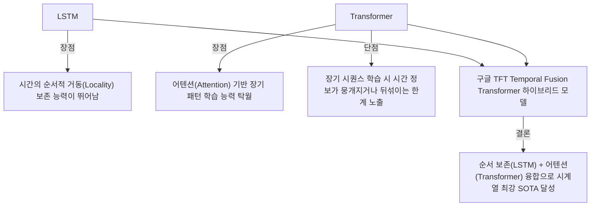

# 머신러닝 강의 요약 (2026-05-27)

## 1. 시계열 이상탐지(Anomaly Detection) vs. 시계열 예측(Forecasting)

시간의 흐름에 따른 시계열 데이터(Time Series Data)를 다루는 두 연구 분야는 시점과 정량적 성능 지표에서 명확한 차이를 보입니다.

### 이상탐지와 시계열 예측의 특징 비교
*   **시계열 이상탐지 (과거/현재 시점 분석)**:
    *   **개념**: 과거부터 현재까지 유입된 시계열 데이터 상에서 비정상적으로 튀는 포인트(이상치)를 적시에 잡아내는 기술.
    *   **본질**: 데이터 포인트별 **이진 분류 (Binary Classification: O/X)** 문제.
    *   **성능 지표**: **F1-Score**, 정밀도(Precision), 재현율(Recall).
*   **시계열 예측 (미래 시점 분석)**:
    *   **개념**: 과거 데이터 시퀀스의 경향성을 학습하여 향후 미래(예: 3일 이내 이상 진동 감지 등)의 거동을 선제적으로 예측하는 기술.
    *   **본질**: 연속된 수치를 맞추는 **회귀 (Regression)** 문제 (점 예측이 아닌 신뢰 마진 오차범위 예측).
    *   **성능 지표**: **MSE (Mean Squared Error)**, **MAE (Mean Absolute Error)**.
*   **연구 동향**: 2024년 이전에는 단순 이상 감지(Detection) 정확도가 100%에 수렴하며 포화되었고, 2025년 이후부터는 미래 시점을 선제 차단하는 예측(Forecasting) 연구가 대세로 부상함.

---

## 2. 시계열 데이터와 딥러닝 모델의 딜레마 (LSTM vs. Transformer)

시계열 데이터 분석 시 **시간의 순서적 상관관계(Temporal Ordering)**를 보존하는 것이 최우선 과제입니다.

### 임계값 (Threshold) 설정의 트레이드 오프 (Trade-off)
*   비지도 학습 기반 이상탐지 시, 복원 오차(Reconstruction Error)가 임계값보다 크면 이상으로 판단함.
*   **임계값을 낮추면**: 미세한 이상도 잘 잡아내어 재현율(Recall)과 F1-Score가 오르지만, 정상 데이터를 이상으로 오진하는 오경보(False Alarm)가 속출해 정밀도(Precision)가 급락함.
*   이러한 상반관계(Trade-off)로 인해 고정 임계값(Static Threshold) 대신 윈도우별 데이터 평균과 표준편차를 동적으로 연계하는 **동적 임계값 (Dynamic Threshold)** 기법이 소타 논문들의 표준으로 채택됨.

---

## 3. ICDE 2024 SOTA 논문 분석: TFMAE (Temporal-Frequency Masked Autoencoder)

### 논문 정보
*   **제목**: *TFMAE: Temporal-Frequency Masked Autoencoder for Time Series Anomaly Detection* (2024년 IEEE 최고 권위 컨퍼런스 중 하나인 ICDE 발표)
*   **연구 주체**: 덴마크 및 중국 연구진의 퓨전 연구 결과.

### 핵심 아키텍처 및 기여점
1.  **시간-주파수 듀얼 브랜치 (Dual-branch)**:
    *   기존 마스크드 오토인코더(MAE) 모델은 시간 도메인에서만 데이터를 마스킹하여 시간적 편향(Temporal Bias)이 생겼음.
    *   TFMAE는 고속 푸리에 변환(**FFT**)을 통해 원래 시계열 데이터를 주파수(Frequency) 영역으로도 동시 사상하여 양쪽 영역 모두에서 독립 마스킹을 수행함.
2.  **초고비율 마스킹 (75%~90%)**:
    *   전체 데이터의 75% 이상을 가려두고 빈칸을 강제 복원하게 훈련함으로써 모델의 표현력을 극한으로 끌어올림.
    *   마스킹 비율이 높아 연산해야 할 인코더 입력량이 25% 미만으로 감소하여 학습 속도가 획기적으로 단축됨.
3.  **대조 학습 (Contrastive Learning) 적용**:
    *   시간 도메인 브랜치와 주파수 도메인 브랜치에서 추출된 잠재 벡터 간의 정렬(Alignment)을 위해 대조 손실 함수를 결합, 두 영역의 보완적 정보 결합력을 극대화함.

---

## 4. 대학원생을 위한 학술 논문 작성 및 학회 발표 꿀팁

교수가 대학원 논문 심사 및 현업 컨설팅을 수행하며 체득한 핵심 논문 작성 가이드라인입니다.

### ① 논문 집필 순서 (Rule of Thumb)
*   **제목(Title)부터 짓는 실수를 피할 것**.
*   가장 먼저 본인의 독창적인 수식과 파이프라인 그림이 담긴 **'방법론 (Methodology)'** 섹션을 완벽히 기술한 뒤, 이를 검증하는 **'실험 (Experiments)'** 섹션을 쓰고, 최종적으로 **'서론 (Introduction)'과 '결론 (Conclusion)'** 순으로 바깥으로 확장하며 채워나가야 논리적 붕괴가 발생하지 않음.

### ② 초록 (Abstract) 빌드업 5단계 공식
1.  **배경 (Background)**: 연구 대상 도메인의 글로벌 기술 트렌드 및 유용성 기술 (1문장).
2.  **문제 정의 (Problem Statement)**: 기존 SOTA 모델들이 가진 치명적 한계점 기술 (1문장).
3.  **제안 기법 (Proposed Method)**: 본 논문이 제안하는 신규 아키텍처 명칭 제시 (1문장).
4.  **작동 원리 (Key Mechanism)**: 제안 아키텍처가 문제를 해결하는 2~3가지 메커니즘 설명.
5.  **성능 수치 (Experimental Result)**: 공개 벤치마크 데이터셋에서 기존 대비 F1-Score 등이 몇 % 개선되었는지 정량적 실측 수치 제시 (1문장).

### ③ 저널(Journal) 논문과 학술대회(Conference) 논문의 시각적 구분
*   **저널 논문**: 분량이 보통 15~20페이지 이상으로 매우 길며, 한국 학회나 글로벌 트렌드상 논문 가장 마지막 장에 **저자 프로필 사진 및 약력(Biography)**이 포함되는 것이 FM 규격임.
*   **학술대회 논문**: 교류 목적으로 페이지 수가 상대적으로 짧고 저자 프로필 사진을 첨부하지 않음.

### ④ 학술적 신뢰도를 높이는 작성 가이드라인
*   **1인칭 배제**: 주관적인 단독칭 "I(나)" 대신 객관적 공동체의 느낌을 주는 **"We(우리)" 또는 "Our(우리의)"**로 작성함.
*   **어블레이션 스터디 (Ablation Study) 기재**: 본인이 제안한 복수 모듈의 기여도를 증명하기 위해, 특정 모듈을 제외했을 때의 성능 하락 수치를 **`w/o` (without의 약어)** 기호로 표에 정리하여 심사위원의 비판에 선제 대응함 (예: `w/o FFT Branch`).
*   **결론 (Conclusion)은 짧고 건조하게**: 결론을 화려하고 길게 적어 입증되지 않은 주장을 담으면 심사위원(Reviewer)들의 집중 난타 표적이 되어 게재 거절(Reject) 확률이 올라감. 결론은 본문 요약 수준으로 극히 짧게 작성할 것.
*   **최신 레퍼런스(References) 장착**: 참고문헌 리스트의 **최소 50% 이상은 반드시 최근 1~2년 이내의 SOTA 학회/저널 논문**으로 구성해야 함. 레퍼런스가 낡으면 최신 연구 트렌드를 모르는 진부한 연구로 간주되어 리젝트됨.
*   **아카이브 (arXiv) 인용 시 주의**: 피어 리뷰 전 초안이 올라오는 아카이브 특성상, 최종 탈락한 조악한 논문을 인용하는 우를 범할 수 있으므로 게재 역사를 재차 검증한 후 레퍼런스에 추가할 것.

### ⑤ 콩글리시(Konglish) 영어 발표에 대한 두려움 극복
*   해외 저명 학술대회 참관 결과, 카이스트나 해외 유명 대학의 연구원들도 완벽한 네이티브 발음이 아닌 콩글리시 및 악센트 섞인 영어로 발표하는 경우가 흔함.
*   학계는 영어 발음보다 발표 장표에 기재된 **독창적 아이디어, 수식의 완전성, 데이터 검증 결과**에 집중하므로 대학원생들은 어학적 두려움을 버리고 학회 발표 기회가 오면 주저 없이 참가할 것을 권함.
