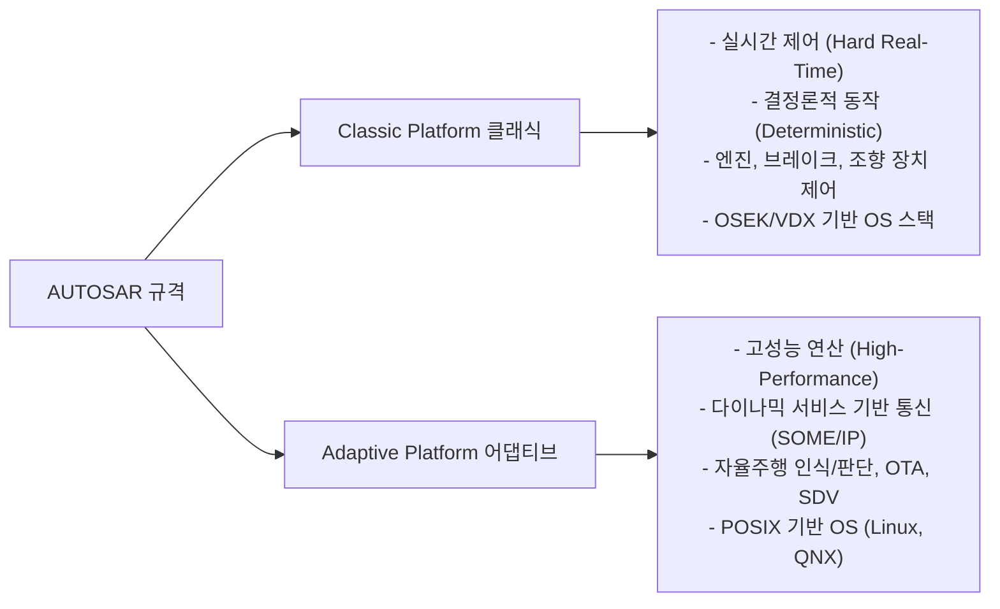

# 자율주행이동체 실제 강의 요약 (2026-04-13)

## 1. 오토사 (AUTOSAR) 개요 및 모토

### 정의
*   **AUTOSAR (Automotive Open System Architecture)**: 자동차 전장 시스템의 소프트웨어 인프라스트럭처 표준화를 위해 글로벌 완성차 제조사(OEM), 부품사(Tier-1) 및 반도체/SW 기업들이 연합하여 개발한 오픈 표준 아키텍처.
*   실질적으로 차량용 마이크로컨트롤러(MCU) 위에서 동작하는 전장용 운영체제(OS) 및 미들웨어의 공통 프레임워크 역할을 수행함.

### 개발 모토 (Core Motto)
> [!IMPORTANT]
> **"협력은 표준화에서, 경쟁은 구현에서" (Cooperate on standards, compete on implementation)**
> 공통 미들웨어나 통신, 메모리 등 기초 소프트웨어 인프라는 공동 표준화하여 개발 비용을 낮추고(협력), 완성차와 부품사들은 차량 성능을 극대화하는 독자 어플리케이션 성능으로 경쟁(경쟁)하자는 철학을 담고 있음.

### 도메인(Domain) 적용 역사
*   **초기 3대 핵심 도메인**: 바디 (Body), 섀시 (Chassis), 파워트레인 (Powertrain) 중심 적용.
*   **현재 6대 도메인**: 위 도메인을 비롯하여 안전(Safety), 인포테인먼트/멀티미디어, 텔레매틱스 등 차량 전체 도메인으로 규격 확장.

---

## 2. 오토사 플랫폼 분류 (클래식 vs. 어댑티브)

오토사 규격은 차량 제어의 목적에 따라 크게 두 가지 플랫폼으로 나뉩니다.



---

## 3. 오토사 레이어(Layer) 아키텍처

오토사는 소프트웨어를 하드웨어(ECU)와 디커플링(Decoupling, 독립성 확보)하기 위해 다음과 같은 다층(Multi-layer) 구조를 정의합니다.

```
+-------------------------------------------------------------+
|               어플리케이션 레이어 (Application Layer)        |
|  - 기능 수행 소프트웨어 컴포넌트 (SWC)들로 구성               |
+-------------------------------------------------------------+
|                    런타임 환경 (RTE)                        |
|  - SWC-SWC 및 SWC-BSW 간 가상 버스 통신 구현 (RTE Code 자동생성) |
+-------------------------------------------------------------+
|                                                             |
|                       기초 소프트웨어                       |
|                       (BSW: Basic Software)                 |
|                                                             |
|  [Services Layer] : OS, 메모리, 통신, 보안, 시스템 관리      |
|  ---------------------------------------------------------  |
|  [ECU Abstraction Layer] : 외부 디바이스 추상화             |
|  ---------------------------------------------------------  |
|  [MCAL (MCU Abstraction Layer)] : 레지스터 직접 제어 및      |
|   상위 레이어의 하드웨어(칩) 종속성 차단                     |
+-------------------------------------------------------------+
|                    하드웨어 (ECU / MCU)                     |
+-------------------------------------------------------------+
```

### ① Application Layer (어플리케이션 레이어)
*   **SWC (Software Component)**: 제어 로직을 직접 수행하는 소프트웨어 컴포넌트들의 집합.
*   **특징**: 하드웨어 종류나 타겟 ECU를 전혀 알 필요 없이 독립적으로 설계됨.
*   **SWC 디스크립션 (Description)**: 컴포넌트의 메모리 요구사항, 실행 속도 주기, 포트 인터페이스 규격 등을 작성한 XML 형식의 표준 문서(**ARXML**).
*   **센서/액추에이터 SWC (Sensor/Actuator SWC)**: 센서나 액추에이터는 물리적 고유 특성이 강해 완전 추상화가 불가능하므로, 예외적으로 하드웨어 종속성을 일부 반영하는 특수 컴포넌트로 분리 관리함.

### ② RTE (Runtime Environment, 런타임 환경)
*   어플리케이션 SWC들이 하위 레이어를 의식하지 않고 상호 데이터를 교환할 수 있게 하는 통신 미들웨어.
*   소프트웨어 설계 도구에 ARXML을 로드하여 RTE 코드를 자동으로 빌드 및 생성함.

### ③ BSW (Basic Software, 기초 소프트웨어)
*   **Services Layer**: 공통 인프라(OSEK OS 스택, 플래시 메모리 관리, Comm 통신 서비스 등) 제공.
*   **ECU Abstraction Layer**: 칩 외부에 실장된 외부 회로 및 디바이스 사양을 추상화하여 하드웨어 변경 시의 전파 차단.
*   **MCAL (Microcontroller Abstraction Layer)**: 칩 내부 레지스터를 직접 제어하여 상위 소프트웨어가 인피니언, 르네사스, NXP 등 반도체 제조사 칩 사양에 종속되지 않게 하는 최소 추상 레이어 (반도체 제조사가 직접 패키징하여 배포함).
*   **CDD (Complex Device Driver, 복잡 디바이스 드라이버)**: 
    *   오토사의 표준 아키텍처 레이어를 거치면 연산 지연(오버헤드)이 발생해 수 마이크로초(µs) 수준의 초고속 실시간 제어가 필요한 파워트레인 모터 각도 제어 등에 불리함.
    *   이를 위해 BSW 표준 레이어를 우회(Bypass)하여 칩 레벨에 직접 연결할 수 있도록 예외적으로 길을 터준 드라이버 영역.

---

## 4. 포트 (Port) 및 인터페이스 (Interface) 모델

SWC 간 또는 SWC와 BSW 간 통신은 포트 규격과 그 인터페이스 속성(클라이언트-서버, 샌더-리시버)으로 상세 정의됩니다.

### 포트 구분
*   **P-Port (Provide Port)**: 데이터를 발신(제공)하거나 서비스를 제공하는 인터페이스 채널.
*   **R-Port (Require Port)**: 데이터를 수신(요구)하거나 서비스를 호출하는 인터페이스 채널.

### 인터페이스 종류
1.  **샌더-리시버 (Sender-Receiver, S-R) 인터페이스**
    *   데이터의 송수신 및 상호 교환을 목적으로 함.
    *   통상 **넌블로킹(Non-blocking)** 방식으로 동작하여 보낸 즉시 자신의 동작으로 돌아옴.
2.  **클라이언트-서버 (Client-Server, C-S) 인터페이스**
    *   특정 기능이나 동작(오퍼레이션)을 상대편에게 요구하여 수행하게 하는 원격 프로시저 호출(RPC) 형태.
    *   **동기식 (Synchronous)**: 호출 즉시 호출부(Client)가 블로킹(Blocking)되어 대기하다가 결과가 반환되면 다시 진행함.
    *   **비동기식 (Asynchronous)**: 호출 후 결과 대기 없이 즉시 제어권이 반환(Non-blocking)되어 자기 일을 하다가, 서버 완료 시점에 콜백(Callback)이나 폴링으로 결과를 취득함.

---

## 5. 오토사 생태계 및 비하인드 스토리

### 오토사 컨소시엄 파트너십 단계
오토사에 가입한 100여 개 이상의 기업 및 학계 등은 엄격한 계급 체계로 나뉩니다.
*   **Core Partner (코어 파트너)**: BMW, Benz, Bosch, Continental 등 창립 멤버 아홉 개 사로 구성되어 있으며 오토사 개발 방향과 라이선스를 독점 지휘함.
*   **Premium Member (프리미엄 멤버)**: 실질적인 기술 워킹그룹 리더십을 행사하며 하위 사양을 공동 정의함.
*   **Associate Member (어소시에이트 멤버)**: 최하위 등급으로, 최신 오토사 코드나 문서를 사전에 받아 테스트해 볼 권한이 주어짐.

### 국내 교육 및 실무 인프라 팁
*   국내 완성차 및 Tier-1 협력사들은 오토사 기술 내재화를 위해 교육이 절대적으로 필요함.
*   국내 강소기업인 **팝콘사 (Popcornsar)**는 오토사 엔지니어링 툴 공급 및 교육 서포트를 가장 활발히 제공하는 기업이므로 관련 정보 습득과 라이브러리 테스트 시 해당 사의 아카데미 교육을 신청해 이수하는 것을 추천함.
