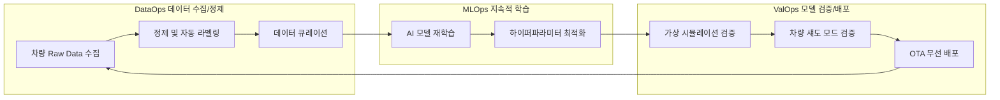

# 자율주행이동체 실제 강의 요약 (2026-04-27)

## 1. SDV에서 AIDV로의 패러다임 시프트

### SDV(Software Defined Vehicle)에서 AIDV(AI Defined Vehicle)로의 명칭 전환
*   전통적인 SDV는 차량의 하드웨어 스펙을 소프트웨어가 제어하고 결정한다는 패러다임이었습니다.
*   그러나 최근 2~3년 사이에 딥러닝 기반 AI의 폭발적 성장으로 인해 차량의 거동, 인지, 판단 메커니즘을 소프트웨어 코딩이 아닌 AI 모델이 전적으로 규정하는 **AIDV (AI Defined Vehicle)** 시대로 빠르게 이전하고 있습니다.

### 기존 SW 개발 방식과 딥러닝 기반 개발 방식의 비교
| 구분 | 전통적 소프트웨어 개발 (Rule-based) | 딥러닝/AI 기반 개발 (Data-centric) |
| :--- | :--- | :--- |
| **코드 구조** | 수만~수백만 라인의 복잡한 규칙(Rule) 기반 소스코드 작성 | 데이터 파이프라인 중심의 간결한 아키텍처 코드 |
| **데이터 요구량** | 상대적으로 적은 테스트 데이터셋 요구 | 방대한 지도 학습(Labeled) 및 무감독 학습 데이터 필수 |
| **작동 거동** | 입력값에 따라 결과가 항상 일관된 결정론적(Deterministic) 거동 | 확률과 통계적 분포에 기반한 비결정론적(Probabilistic) 거동 |

---

## 2. AIDV 시대의 무한 루프 MLOps 개발 방법론

기존의 V-Model 프로세스는 차량을 출시(SOP)하면 개발 주기가 사실상 종료되는 구조였습니다. 하지만 실시간 데이터 기반의 AIDV 환경에서는 테슬라가 개척한 방식과 같이 차량 출고 후에도 데이터를 지속 수집 및 훈련하여 배포하는 **DevOps / MLOps 루프**가 필수적입니다.

### 글로벌 빅테크의 클라우드 플랫폼 패권 경쟁
*   마이크로소프트(Azure), 아마존(AWS) 등 글로벌 클라우드 기업들은 자율주행 개발사들이 자체 데이터 파이프라인을 구축할 수 있도록 DataOps, MLOps, ValOps 스택이 결합된 인프라 솔루션을 선도적으로 제공하고 있습니다.
*   **중국 자율주행 기업의 해외 진출과 안보적 쟁점**:
    *   중국 내수 시장의 자율주행 상용화 및 로보택시 검증이 포화 상태에 이르자 바이두(Baidu), 포니에이아이(Pony.ai) 등이 한국, 두바이, 일본 등으로의 진출을 꾀하고 있습니다.
    *   **데이터 주권 문제**: 중국 자율주행 차량이 국내 정밀 지도로 주행하며 취득한 수많은 센서 및 지도 원시 데이터가 중국 본토 서버로 유입될 우려가 있음. 이로 인해 한국 정부는 반드시 국내 로컬 클라우드 인프라(Azure Korea, AWS Korea 등) 내에서 데이터를 처리하고 격리하도록 규제 가이드라인을 강제하고 있는 상황입니다.

---

## 3. 설명 가능한 AI (XAI)에서 신뢰할 수 있는 AI (Trustworthy AI)로

딥러닝의 블랙박스 특성으로 인해 사고 시 책임 규명과 기능 보증이 어렵습니다. 자율주행 상용화를 위해서는 다음 요소를 갖춘 **신뢰할 수 있는 AI** 프레임워크가 전제되어야 합니다.
*   **설명 가능성 (Explainability / XAI)**: AI 모델이 특정 조향/제동을 결정하게 된 내부 레이어 판단 근거를 인간 엔지니어가 분석 및 납득할 수 있게 명시하는 능력.
*   **책임성 (Responsibility)**: 예측 실패 및 시스템 충돌 상황 시 도덕적/법적 귀책 범위를 파악할 수 있는 예외 처리 로직 설계.
*   **보안성 및 프라이버시 (Security & Privacy)**: 데이터 수집 시 얼굴/번호판 비식별화 처리 및 외부 해킹 공격에 대한 방어벽 확보.
*   **통계적 유효성 (Validity)**: 모델이 제한된 주행 시나리오에만 과적합(Overfitting)되지 않고 보행자 무단횡단 등 특이 상황(Corner Case)에서도 일관된 안전 마진을 발휘하는 신뢰 도메인 검증.

---

## 4. 글로벌 SDV/AIDV 아키텍처 생태계 동향

### ① 콘티넨탈 (Continental)의 SDV/AIDV 3대 축과 통합 모션 제어
*   콘티넨탈 테크쇼(Tech Show) 발표 기준, SDV 투자의 핵심 가치는 **Safe(안전), Exciting(즐거운 승차감 및 탑승 경험), Autonomous(자율주행)**로 요약됩니다.
*   **통합 모션 제어 (Holistic Motion Control)**: 기존에 단일 부품별로 개별 통제되던 서스펜션, 스티어링, 브레이크를 하나의 통합 소프트웨어 레이어 아래 유기적으로 결합·제어함으로써 차량 전반의 거동 안정성과 안락함을 비약적으로 향상시키는 콘티넨탈의 시그니처 아키텍처.

### ② 오로라 (Aurora)와의 하드웨어-소프트웨어 분업 모델
*   **오로라 (Aurora Innovation)**: 구글 자율주행 프로젝트(웨이모의 모태)를 7년간 책임지며 전설적인 개발팀장으로 군림했던 **크리스 엄슨 (Chris Urmson)**이 설립한 나스닥 상장 자율주행 전문 스타트업.
*   **협업 비즈니스**: 콘티넨탈이 전방/측후방 라이다·카메라·레이다 하드웨어 모듈 및 ADCU(자율주행 도메인 컨트롤러) 생산 기지를 전담하고, 오로라는 자율주행 인공지능 소프트웨어를 얹어 제공하는 상호 윈-윈(Win-Win) 생태계 구축.

### ③ 쏘아피 (SOAFEE) 오픈 표준 아키텍처
*   **SOAFEE (Scalable Open Architecture for Embedded Edge)**: 모바일 CPU의 강자 **Arm**의 주도로 AWS, 폭스바겐 소프트웨어 자회사인 카리아드(Cariad), 콘티넨탈 등이 참여하는 차량용 클라우드 네이티브 표준 개발 컨소시엄.
*   **목표**: 클라우드 가상 머신(가상 차량 환경)에서 컴파일 및 시뮬레이션을 완료한 소프트웨어 이미지를 실제 차량 에지 디바이스(MCU/AP)에 어떤 왜곡도 없이 그대로 다운로드하여 실행할 수 있는 개발 환경의 일치(Environment Parity)를 목표로 함.

### ④ 오토웨어 (Autoware)의 비즈니스 모델 분석
*   일본의 스타트업 **티어포 (Tier IV)**가 주도하여 만든 세계 최초의 자율주행용 오픈소스 플랫폼.
*   **미끼 상품 전략**: 
    *   기초적인 인지·판단·제어 아키텍처를 제공하는 소스코드(오토웨어)는 무료(Open-source)로 공개하여 학계와 연구소의 진입 장벽을 낮춤 (누구나 몇 달 안에 50점 수준의 임시 차량 주행을 시연 가능).
    *   그러나 실제 사고가 없는 99.9% 신뢰도의 로보택시 및 상용 서비스를 개발 및 운영하려면 티어포가 제공하는 정밀 지도(HD Map) 빌더, 원격 관제(Fleet Management), 유료 시뮬레이터 인프라 등 핵심 유료 상용 솔루션을 연계 구매해야만 동작 가능한 상업 모델을 취하고 있음.
