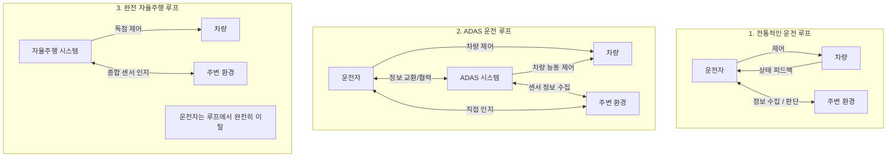

# 자율주행이동체 실제 강의 요약 (2026-03-23)

## 1. ADAS (Advanced Driver Assistance Systems) 정의 및 운전 루프 변화

### 자동차의 3대 핵심 가치와 ADAS
*   자동차 산업의 전통적인 밸류는 **안전(Safety), 편의(Convenience), 환경(Environment)**입니다.
*   환경 분야는 친환경차(그린카)의 영역이므로 본 강좌에서는 **안전**과 **편의** 두 가지 핵심 영역을 강화하여 부가가치를 창출하는 ADAS 시스템에 집중합니다.

### 드라이빙 루프(Driving Loop)의 진화
전통적인 운전 방식에서 완전 자율주행으로 가는 과정은 차량-운전자-환경 간의 제어 루프 변화로 설명할 수 있습니다.

---

## 2. ADAS 주요 기능과 시장성 (Safety vs. Convenience)

### 대표적인 편의(Convenience) 기능
1.  **SPAS / Parking Assist (주차 보조)**
    *   **초기 기술**: 10여 년 전 상용화되었으며, **초음파 센서(감지거리 3~5m)**만 사용함.
    *   **한계**: 주차 공간 인식 능력이 떨어지고 속도가 매우 느려 초보자에게만 유용했음. 숙련자들에게 외면받아 상업적으로 실패한 대표적 기능.
2.  **ACC (Adaptive Cruise Control, 적응형 크루즈 컨트롤)**
    *   기존 속도 고정형 크루즈 컨트롤에서 전방 레이다를 통해 앞차의 속도와 거리를 인식하여 능동적으로 가속/감속 제어.
    *   **상업적 의의**: **ADAS 기술 중에서 자동차 업계가 최초로 본격적인 수익(캐시카우)을 올리기 시작한 성공작**.
3.  **TJA (Traffic Jam Assist, 정체구간 주차 보조)**
    *   도심 정체 구간에서 가속과 감속(Stop & Go)을 스스로 지원하여 운전자의 피로도를 혁신적으로 낮춤.
4.  **LKA / LKS (Lane Keeping Assist/System, 차로 유지 보조)**
    *   카메라가 차선을 인식해 차로 중앙을 유지하도록 조향을 보조하는 기능. 현재 ACC와 함께 가장 대중적인 편의 기능.

### 대표적인 안전(Safety) 기능
1.  **AEB (Autonomous Emergency Braking, 자동 긴급 제동)**
    *   전방 충돌 위험 시 운전자가 브레이크를 밟지 않아도 차량이 스스로 풀 제동을 걸어 충돌을 예방. 안전 성능 규제 강화로 인해 필수 장착되는 추세.
2.  **Lane Change Assist (차로 변경 보조)**
    *   차량 측후방 센서 정보와 연계하여 안전하게 스스로 차선을 변경할 수 있도록 지원.
3.  **AES (Active Emergency Steering, 비상 조향 제어)**
    *   위험 상황에서 브레이크만으로 충돌 회피가 불가능할 때 차량이 스스로 비상 조향을 실시하는 기술.
    *   **양산 지연 원인**: 급박한 상황에서 액티브 조향 제어는 차량의 슬립을 유발하거나 인접 차선의 차량과의 2차 사고 등 더 큰 위험을 부를 수 있어, 현재까지 **양산(상품화) 적용이 지연**되는 고난도 기능.
4.  **Active Seatbelt (액티브 시트벨트)**
    *   전통적인 시트벨트는 충돌 후에만 탑승자를 묶어주는 패시브(Passive) 형태였으나, 충돌 전 위험 상태를 미리 감지해 시트벨트를 강하게 되감아 탑승자를 안전한 위치로 밀착시키는 능동형 안전 장치.

---

## 3. 핵심 센서 3대장 상세 분석 (레이다, 라이다, 카메라)

### ① 레이다 (Radar: Radio Detection and Ranging)
*   **원리**: 라디오파(전자기파)를 방사하고 반사되어 돌아오는 신호를 수신해 물체와의 **거리(Range), 상대 속도(Velocity), 각도(Angle)**를 측정.
*   **구조적 특징**: 도시락통 모양으로 방수/방열 및 전자파 대응 패키징이 필수적임. 송신(Tx) 안테나는 전기 신호를 강하게 쏘는 역할로 개수가 적으나, 수신(Rx) 안테나는 감쇄되어 돌아오는 미세 반사파를 수집해야 하므로 면적이 넓고 안테나 개수가 더 많음.
*   **주파수 트렌드**:
    *   과거에는 단거리용 **24GHz(SRR)**와 전방 장거리용 **77GHz(LRR)**가 공존했음.
    *   현재는 **77GHz~79GHz 대역으로 단일화**되는 추세. 하드웨어를 77GHz 단일 플랫폼으로 통합하고 소프트웨어를 다르게 튜닝(Software Defined Radar)하여 단거리/장거리로 활용하는 방식이 원가 절감에 압도적으로 유리하기 때문.
*   **가격 트렌드**: 치열한 경쟁 및 원칩화(SOC)의 진전으로 과거 20~30만원 선이었던 레이다 모듈 단가가 **현재 대당 약 5만원 선**까지 급락함.
*   **강점**: 비, 눈, 안개 등 악천후와 센서 전면의 커버 오염에도 전자기파 투과력이 뛰어나 **가장 기후 신뢰성이 높은 강인한 센서**.
*   **미래 트렌드 (4D Imaging Radar)**:
    *   기존 3D 레이다에 상하(Elevation, 높이) 정보 측정 능력을 더한 기술.
    *   수많은 안테나 채널을 통해 고해상도 포인트 클라우드를 출력함으로써 고비용의 라이다(LiDAR)를 대체하고자 활발히 연구개발 중임.

### ② 라이다 (LiDAR: Light Detection and Ranging)
*   **원리**: 레이저(빛) 펄스를 방사하고 물체에 반사되어 돌아오는 시간 차이(**ToF: Time of Flight**)를 측정해 초정밀 3차원 포인트 클라우드(Point Cloud) 데이터를 획득.
*   **기술의 핵심**: 레이저 송신부(Tx)는 비교적 단순하고 저렴하나, 피코초(picosecond) 단위의 정밀한 광신호 복귀 시간을 측정하고 감지하는 **수신부(Receiver, 리시버) 하드웨어가 라이다의 핵심 기술이자 단가 상승의 주요인**.
*   **형태의 변화**:
    1.  **Mechanical (기계 회전식) 라이다**: 모터를 이용해 센서 전체 또는 내부 거울을 360도 회전시킴. 채널 수가 많아질수록(최대 128채널) 해상도는 높아지나 부피가 크고 기계 마모로 고장 위험이 높음. 초창기에는 대당 1억 원을 웃돌아 양산이 불가능했으나 중국의 허사이(Hesai), 로보센스(RoboSense) 같은 기업들이 추격하여 최근 양산 모듈 가격을 약 $500대까지 낮춤.
    2.  **Solid-State / MEMS 라이다**: 반도체 칩 형태로 미세 거울을 제어하거나 광위상배열(OPA) 등의 방식을 사용해 기계 회전부를 없앰. 내구성이 뛰어나 차량 탑재 및 양산에 유리함.
*   **파장 시프트**:
    *   **905nm**: 저렴하게 구현 가능하지만 눈 건강에 영향을 줄 수 있어 출력 세기에 한계가 있고 이에 따라 탐지 거리 확장이 어려움.
    *   **1550nm**: 망막에 흡수되지 않아 사람 눈에 안전하므로 고출력 레이저를 쏠 수 있어 탐지 거리가 대폭 증가함. 단, 수신기에 인듐갈륨비소(InGaAs) 센서가 필요해 단가가 급격히 상승함.
*   **시장 내 위상**: 업계의 지속적인 "폭발적 성장" 장담에도 불구하고, 3D 포인트 클라우드 처리에 따르는 컴퓨팅 오버헤드와 비싼 가격으로 인해 양산 적용이 계속 연기되고 있음. 현대자동차의 경우 5년 전부터 라이다 양산 적용을 검토 및 발표했으나 최종 단계에서 여러 번 연기·취소한 역사가 있음.

### ③ 카메라 (Camera)
*   **장점**: 물체의 형태, 색상, 텍스트 정보(차선, 표지판, 신호등)를 직접 파악할 수 있는 유일한 센서.
*   **단점**: 눈, 비, 안개, 야간 저조도 및 직사광선 환경(역광)에서 인식 정확도가 급격히 저하됨.
*   **테슬라(Tesla)의 Vision-Only 노선**: 값비싸고 연산 오버헤드가 큰 라이다 및 레이다를 배제하고, 고해상도 카메라 데이터에 고성능 AI(Deep Learning)를 결합하여 완전 자율주행을 추구하는 전략.

---

## 4. 센서 퓨전 (Sensor Fusion)과 업계 비하인드 스토리

### 센서 퓨전의 필요성
단일 센서로는 차량 제어의 필수적인 "신뢰성(Reliability)"과 "안전 마진(Safety Margin)"을 100% 확보하기 어렵습니다. 예를 들어 카메라의 분류 정확도와 레이다의 정밀한 거리/속도 측정 정보 및 악천후 강인성을 결합하여 센서 퓨전을 구현합니다. 각 센서 데이터를 어디서(Raw data 레벨 vs. Object 레벨) 어떻게 융합하는지가 부품사 및 OEM사의 핵심 기술력입니다.

### 업계 개발 비하인드 및 생태계
*   **만도(Mando) vs. 현대모비스(Hyundai Mobis)**:
    *   현대모비스는 만도 대비 글로벌 매출 및 회사 규모가 약 10배 이상 큰 거대 기업임.
    *   그러나 국내 최초로 ADAS용 레이다, 카메라, EPS, ESC를 자체 설계 및 국산화하여 양산에 성공한 것은 모비스가 아닌 **만도(Mando)**임.
    *   만도의 ADAS 사업부는 현재 **HL클레무브 (HL Klemove)**라는 이름으로 분사되어 해당 사업을 전문적으로 이끌고 있음.
    *   현대모비스와 만도는 사실상 범현대가(사촌 관계) 내부에서 선의의 경쟁 및 기술 협력을 이어오고 있는 독특한 생태계를 구성함.
*   **비트센싱 (Bitsensing)의 탄생**:
    *   국내 레이더 스타트업인 비트센싱은 만도에서 직접 ADAS 레이더를 설계하고 양산했던 핵심 개발 팀장이 스핀오프(창업)하여 설립한 회사임. 따라서 비트센싱의 레이다 기술 뿌리 역시 만도의 핵심 기술력에 닿아 있음.
