# 자율주행이동체 실제 강의 요약 (2026-03-30)

## 1. 자동차 개발 프로세스 개요

자동차 신차 개발은 수년의 기간과 수천억 원의 비용이 소요되는 복잡한 프로세스이며, 동시 공학(Concurrent Engineering) 관점에서 진행됩니다.

### 신차 개발의 3대 분류
1.  **풀 모델 체인지 (Full Model Change)**
    *   **특징**: 차량의 뼈대가 되는 플랫폼(Platform) 및 섀시 아키텍처부터 외관, 전장까지 완전히 새롭게 개발.
    *   **기간/비용**: 통상 2년(24개월) 가량 소요되며, 수천억 원의 연구개발비가 투입됨.
2.  **페이스리프트 (Face Lift)**
    *   **특징**: 플랫폼은 그대로 유지하면서 외관(앞/뒤 디자인), 실내 인테리어, 일부 전장/편의 사양을 대규모로 변경하는 단계.
3.  **이어 모델 체인지 (Year Model Change)**
    *   **특징**: 연식 변경 모델로, 소비자 선호 사양 조정이나 소규모 원가 절감 등을 적용하는 단계.

### 자동차의 라이프 사이클과 클래식카 문화
*   자동차는 휴대폰과 달리 기획 단계부터 **20년 이상의 라이프 사이클(AS 부품 공급 및 품질보증 포함)**을 고려함.
*   **독일의 클래식카 문화**:
    *   독일에서는 부의 상징이 겉보기 장신구보다 50~60년 이상 된 클래식카를 주말에 온전히 작동하여 도로를 달릴 수 있는가에 있음.
    *   지역 클래식카 페스티벌을 개최하여 차량을 자랑하고 소시지와 맥주를 즐기는 문화가 정착되어 있음. 이러한 클래식카 유지를 가능케 하는 백본이 바로 자동차 산업의 장기 품질 보증 및 부품 보존 체계임.

### 개발 프로젝트의 수장: PM (Project Manager)
*   자동차 회사에서 단일 차종(예: 쏘나타) 개발의 전권과 최종 책임은 사장이나 CTO가 아닌 **PM (임원급: 상무/전무)**이 지게 됨. PM이 예산, 사양, 성능 조율 및 런칭을 책임짐.

---

## 2. 차량 개발 단계별 마일스톤 및 일정 관리

```mermaid
gantt
    title 신차 개발 타임라인 (Model Fix 기점)
    dateFormat  X
    axisFormat %d
    
    section 마일스톤
    모델 픽스 (Model Fix)          :milestone, active, 0, 0
    DV 단계 (Design Validation)     :active, 0, 7
    PV 단계 (Production Validation) :active, 7, 15
    SOP (Start of Production)      :milestone, active, 21, 21
```



### ① 모델 픽스 (Model Fix)
*   **의의**: 차량의 외관 디자인과 구조 설계 레이아웃이 최종 확정되는 시점.
*   **공급망 프로세스 가동**: 모델 픽스 즉시 협력사 대상 정보 요청서(**RFI**, Request for Information) 및 제안/견적 요청서(**RFQ**, Request for Quotation)가 배포됨. 협력사 견적 제안을 통해 부품 선정 및 발주(Sourcing)가 확정됨.

### ② DV (Design Validation, 설계 검증) 단계
*   **기간**: 모델 픽스 후 **약 7개월** 소요.
*   **투입 차량**: 프로토타입 카 (Prototype Car, 시작차).
*   **목적**: 차량 설계가 기능, 성능, 법규 및 신뢰성 측면에서 올바른지를 차량 단위에서 종합 검증 ("Did we build the system right?").

### ③ PV (Production Validation, 양산 검증) 단계
*   **기간**: 모델 픽스 후 **약 15개월** 소요.
*   **투입 차량**: 파일럿 카 (Pilot Car).
*   **목적**: 실제 공장에서 고정된 양산용 툴(Full Tool)과 설비를 사용해 설계 규격을 유지하면서 안정적인 대량 생산(품질 일관성, 생산 리드타임 만족 등)이 가능한지 제조 공정을 검증.

### ④ SOP (Start of Production, 양산 시작)
*   **의의**: 공장에서 양산 1호차가 조립되어 판매가 시작되는 시점.
*   **중요성**: 대외 홍보 및 사전 예약 주문 고객에 대한 인도 일정이 걸려 있어 **SOP 일정 준수는 절대적**이며, 일정 지연 시 협력사 및 부품사 전체에 막대한 패널티가 부과됨. 양산 1호차는 상징적으로 사회 저명인사나 VIP에게 기증 행사를 진행하여 마케팅에 활용함.

---

## 3. 미래 차량 실내 공간 및 디스플레이 디자인 논란

*   **리트랙터블 스티어링 휠 (Retractable Steering Wheel)**:
    *   충돌 사고 시 스티어링 휠은 운전자 흉부/두부에 가해지는 가장 치명적인 위험 요소임.
    *   만도(HL클레무브) 등에서는 자율주행 모드 시 운전석 공간 확보 및 안전성 극대화를 위해 컬럼을 없애고 휠을 접어 대시보드 내로 숨기는 시스템을 구현 완료함.
*   **전면 윈드실드(앞유리) 디스플레이화 논란**:
    *   **디스플레이 업계**: 자율주행 시대에는 운전자가 앞을 볼 필요가 없으므로 앞유리 전체를 불투명/투명 디스플레이로 채워 극장/오피스 환경을 조성하자는 제안.
    *   **완성차 업계**: 곡면 유리를 평면 모니터처럼 균일한 화질로 가공하는 물리적 한계 및 자율주행 신뢰성 보장 문제를 들어 다소 보수적임.
    *   **결론**: 자율주행이 완전화되면 현재 구조(대시보드-앞유리-운전석 구성)의 디자인 자체가 무의미해져, 실내 공간 형태 자체가 목적 기반 차량(PBV)이나 모빌리티 라운지 형태로 완전히 재정의될 것임.

---

## 4. 전장 부품 개발 및 V-Model (V-Cycle) 프로세스

전장 부품(ECU, 센서)은 하드웨어와 소프트웨어가 밀접하게 결합되고 오작동 시 인명 피해로 직결되므로 국제 표준 V-Model 프로세스를 준수합니다.

```
[V-Model 기반 전장 개발 아키텍처]

요구사항 분석 (System Req) -----------------------------> 밸리데이션 (Validation: 시스템/실차 평가)
    \                                                     /
    시스템 아키텍처 설계 ------------------------> 통합 테스트 (Integration Test)
        \                                         /
        하드웨어/소프트웨어 설계 --------> 단위 테스트 (Unit Test)
            \                                 /
             └-----------> 구 현 (Coding) <---┘
```

### 전장 샘플 구분 (A, B, C, D)
*   **A-Sample**: 초기 개념 검증을 위한 시작 샘플. 기계/외관 형상 확인 중심.
*   **B-Sample**: **DV(설계 검증)** 단계에 공급되는 동작 가능한 설계 검증 프로토타입 샘플.
*   **C-Sample**: **PV(양산 검증)** 단계에 투입되는 양산용 금형 및 공정 기반 파일럿 샘플.
*   **D-Sample**: **SOP(양산)**에 최종 납품되는 완전한 양산 품질 보증 샘플.

### V&V (Verification & Validation)의 차이
*   **베리피케이션 (Verification)**: "우리가 설계를 제품에 올바르게 반영했는가?" 상위 요구사항 문서와 하위 세부 설계/코드 간의 일치성과 추적성(Traceability)을 기술적으로 검증하는 하위 레벨 단계.
*   **밸리데이션 (Validation)**: "우리가 고객이 정말 필요로 하는 올바른 시스템을 구축했는가?" 실제 제작된 완성 부품/차량을 대상으로 최종 타당성(예: 실도로 전비 성능 충족, 카메라 물체 분류 정확도 99.9% 등)을 실측 평가하는 상위 레벨 단계.

### 시스템 요구사항 (System Requirements) 정의의 9대 핵심 요소
초보 엔지니어는 기능과 성능만 요구사항에 작성하지만, 고난도 개발을 위해서는 다음 요소가 모두 충족되어야 합니다.
1.  **시스템 상태 및 주행 모드 (System States/Modes)**
2.  **시스템 기능 (System Functions)**
3.  **성능 요구사항 (Performance Requirements)**
4.  **외부 인터페이스 규격 (External Interfaces)**
5.  **동작 환경 조건 (Operating Environments)**
6.  **기술적 한계 및 리소스 제약 (Constraints/Limitations)**: 예 - 제한된 연산 리소스(GPU, CPU, 메모리)
7.  **물리적 거동 특성 및 패키징 무게 제약 (Physical Characteristics/Weight)**
8.  **신뢰성 및 품질 요건 (Reliability/Quality)**: 예 - 방수, 방열, 온도 버퍼 (영하 40도~영상 120도)
9.  **국가별 법규 및 표준 레귤레이션 만족 여부 (Regulations)**

### 오토사 (AUTOSAR) 및 모델 기반 개발 (MBD) 트렌드
*   **AUTOSAR (Automotive Open System Architecture)**:
    *   과거에는 하드웨어와 소프트웨어가 강결합(Decoupling 불가능)되어 부품을 변경하면 소프트웨어를 처음부터 다시 코딩해야 했음.
    *   오토사는 소프트웨어 표준 규격 및 RTE(런타임 환경) 추상화를 통해 **하드웨어와 소프트웨어를 디커플링(분리)**함으로써 코드 재사용성을 극대화함.
*   **MBD (Model-Based Development, 모델 기반 개발)**:
    *   수작업 코딩으로 발생하는 Human Error(오타, 로직 버그 등)를 제거하기 위해 MATLAB/Simulink 등에서 블록 다이어그램(모델)을 그려 논리를 시뮬레이션 검증함.
    *   검증된 모델에서 완전 무결한 C코드를 자동으로 추출하는 **오토코드 제너레이션(Auto-code Generation)**이 전장 개발 실무의 표준으로 정착됨.
