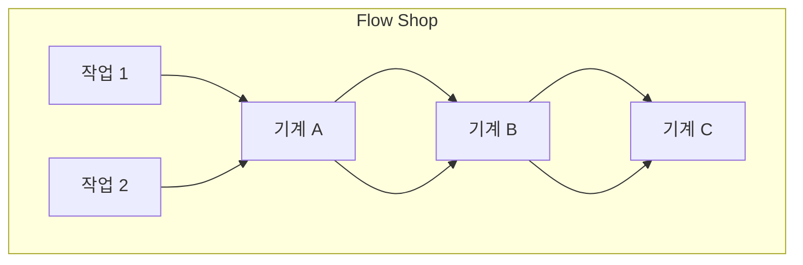
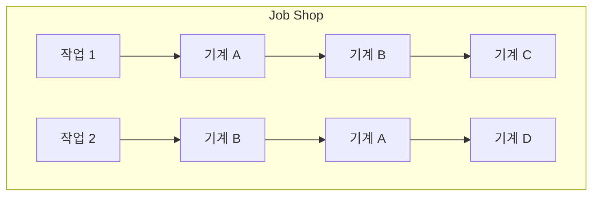
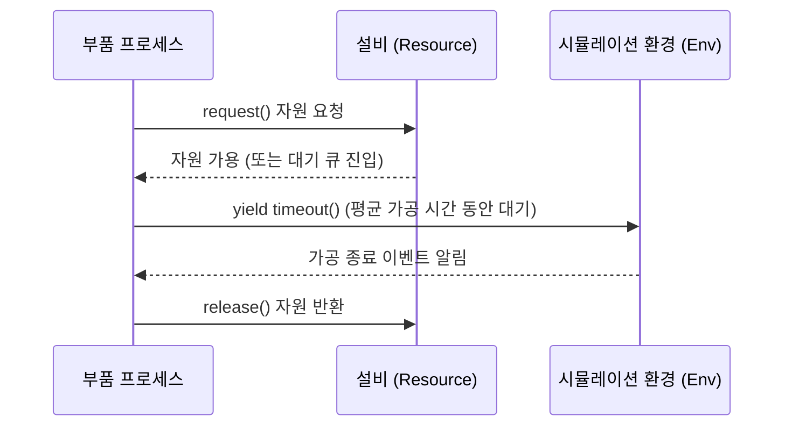

# 제조 데이터 분석과 최적화 (MDAO) 강의 요약 - 2026년 5월 19일

본 강의에서는 제조 물류 및 가공 공정의 핵심 영역인 **스케줄링 이론(Scheduling Theory)**의 기본 개념과 문제 분류, Python **SimPy** 라이브러리를 활용한 이산 사건 시뮬레이션(Discrete-Event Simulation), 그리고 스케줄링 최적화를 위한 알고리즘(ILP, 휴리스틱 규칙, 강화학습)의 적용 방안을 다루었습니다.

---

## 1. 자원 배합 최적화 vs. 공정 스케줄링 최적화

최적화 대상에 따라 문제 정의 방식과 제약 조건의 설계가 크게 다릅니다.

*   **자원 배합 최적화 (Resource Allocation)**:
    시간을 단순한 **'용량(Capacity)'** 개념으로 취급합니다. 예를 들어 가용 가동 시간이 총 $40$시간일 때 제품별 생산 개수를 정하는 문제로, 작업의 시작 시간이나 선후 관계는 고려하지 않고 총 사용량의 합만 제약 조건 이하가 되도록 설계합니다.
*   **공정 스케줄링 (Scheduling)**:
    시간을 **'선후 관계 및 흐름(Sequence & Flow)'** 개념으로 다룹니다. 작업 간의 공정 순서(예: 도색을 하기 전에 조립이 완료되어야 함)가 엄격하게 존재하며, 각 작업이 설비에 투입되는 **구체적인 시점(Start/End Time)**과 **배정 순서**를 결정하는 최적화 문제입니다.

---

## 2. 스케줄링 문제의 3대 모델 분류

제조 및 서비스 공정의 워크플로우에 따라 스케줄링 문제는 다음과 같이 3가지 형태로 구분됩니다.

1.  **플로우 숍 (Flow Shop)**:
    모든 작업이 동일한 설비 순서로 공정을 진행합니다. (예: 자동차 조립 라인, 화학 제품의 배치 공정 등 연속 가공 공정)
2.  **잡 숍 (Job Shop)**:
    각 작업마다 거쳐야 하는 설비의 순서가 다르게 정의되어 있습니다. (예: 다품종 맞춤형 정밀 기계 부품 생산라인)
3.  **오픈 숍 (Open Shop)**:
    공정 순서의 제약이 존재하지 않고, 필요한 설비들을 임의의 순서로 거치면 됩니다. (예: 종합 건강 검진 시 안과, 내과, X-ray 검사 등을 대기 상황에 맞춰 순서 상관없이 방문하는 경우)

---

## 3. 이산 사건 시뮬레이션 (DES)과 SimPy 라이브러리

물리적인 제조 공장을 짓거나 실제로 돌리기 전에 최적의 가동 시나리오를 예측하기 위해 시뮬레이터가 필수적입니다. 본 실습에서는 Python의 **SimPy(Simulation Python)** 패키지를 사용하였습니다.

### 1) SimPy의 핵심 모델 아키텍처
*   **환경 (Environment)**: 시뮬레이션 시간을 관리하고 이벤트를 실행시키는 핵심 엔진입니다.
*   **자원 (Resource)**: 은행 창구, 머신 등 용량 제한이 있는 객체입니다. 프로세스가 자원을 요청(`request`)하고 가공 완료 후 반환(`release`)합니다.
*   **컨테이너 (Container)**: 액체나 벌크 자재처럼 고유 ID가 없는 물질의 충전 및 방출을 모사할 때 사용합니다.
*   **스토어 (Store)**: 유일한 식별 정보를 가진 개별 부품이나 상자를 입출고하는 창고 모델링에 유용합니다.

---

## 4. 스케줄링 평가지표 및 최적화 방법론

### 1) 주요 평가지표 (Metrics)
스케줄링 최적화 시 비용 최소화와 납기 준수를 판단하기 위한 핵심 지표들입니다.
*   **Makespan ($C_{\max}$)**: 모든 작업이 완전히 완료될 때까지 걸린 최종 시간(최대 완료 시간)입니다. 스케줄링 문제의 주된 목적함수로 사용됩니다.
*   **설비 가동률 (Machine Utilization)**: 전체 운영 시간 중 설비가 실제로 작동한 비율입니다.
*   **평균 대기 시간 (Average Wait Time)**: 부품이 다음 설비 가공을 시작하기 전까지 버퍼(Q)에서 대기한 평균 시간입니다.

### 2) 스케줄링 해결을 위한 알고리즘 비교
*   **규칙 기반 배정 휴리스틱 (Dispatching Heuristics)**:
    *   **FIFO (First-In-First-Out)**: 먼저 들어온 작업을 우선 처리.
    *   **SPT (Shortest Processing Time)**: 가공 시간이 가장 짧은 작업을 먼저 투입하여 대기 큐의 병목을 빠르게 해소.
    *   **LPT (Longest Processing Time)**: 가공 시간이 가장 긴 작업을 우선 배치하여 설비 가동 효율 증대.
    *   *특징*: 구현 및 실시간 판단 속도가 우수하지만 전역 최적화를 보장하지 못합니다.
*   **정수 계획법 (ILP)**:
    *   *특징*: 소규모 잡숍/플로우숍 문제에 대해 완벽한 수학적 최적해(Global Optimum)를 보장합니다. 하지만 작업 수가 증가하면 탐색 공간이 기하급수적으로 늘어나 연산 불가 상태(NP-Hard)에 도달합니다.
*   **강화학습 (Deep Reinforcement Learning, DRL)**:
    *   *특징*: 설비 상태, 대기 큐 현황을 상태(State)로 정의하고, 어떤 작업을 다음 기계에 할당할지 행동(Action)을 결정합니다. Makespan을 단축할 때마다 양의 보상(Reward)을 제공하여 학습합니다. 대규모 복잡 공정에서 전통 솔버의 속도 한계를 극복할 대안으로 부각됩니다.

---

## 5. 톰 프로젝트 적용 팁

*   **스케줄링 관련 프로젝트 주제 선정 시**: 
    1. 본인 공장의 설비 라인을 **SimPy**를 통해 코드로 모델링합니다.
    2. 설비 개수를 늘리는 투자 분석 모델링을 하거나, 설비 개수는 유지한 채 **스케줄링 최적화(Heuristics vs. DRL vs. ILP)**를 적용하여 일일 생산량(Makespan)이 얼마나 개선되는지 정량적인 시뮬레이션 데이터를 산출합니다.
    3. 이를 발표 자료에서 그래프 및 간트 차트(Gantt Chart)로 비교 제시하면 완성도 높은 프로젝트로 인정받을 수 있습니다.
