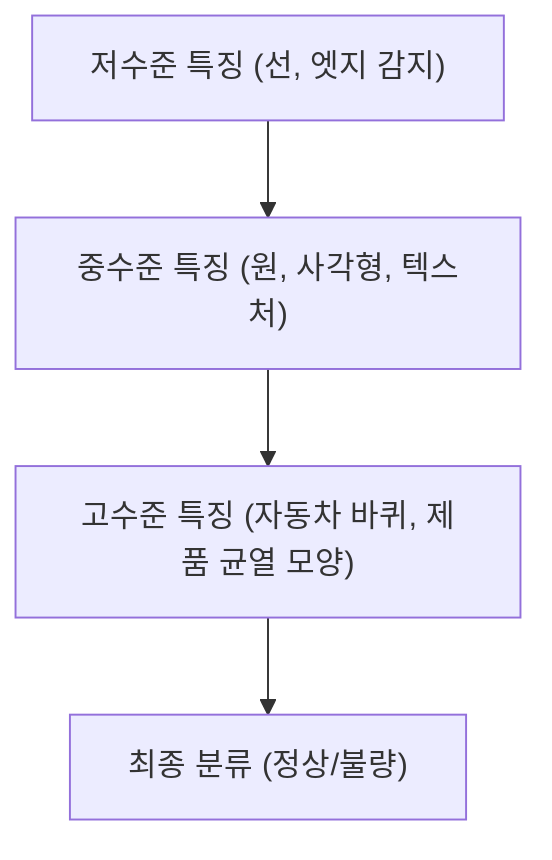
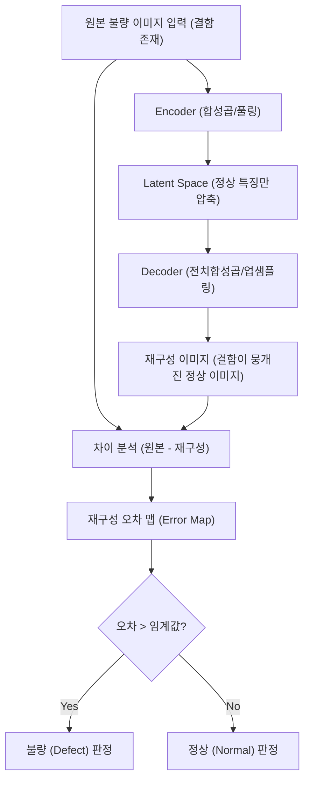

# 제조 데이터 분석과 최적화 (MDAO) 강의 요약 - 2026년 4월 7일

본 강의에서는 이미지 기반 제조 불량 분석을 위한 **CNN(합성곱 신경망)**의 동작 원리, 비지도 학습 기법인 **합성곱 오토인코더(Convolutional Autoencoder, CAE)**를 활용한 이상 탐지 메커니즘, 그리고 딥러닝 판단의 시각적 근거를 제공하는 **Grad-CAM(그레드캠)** 기법에 대하여 학습하고 관련 실습 코드를 분석했습니다.

---

## 1. 이미지 데이터의 특성과 CNN의 필요성

제조 부품의 표면 결함 등을 탐지할 때, 기존의 다층 퍼셉트론(MLP) 방식은 이미지 데이터를 1차원 벡터로 펼쳐서(Flatten) 입력해야 하므로 이미지의 고유한 공간적 정보가 손실되는 문제가 있습니다. 이미지 분석에 CNN이 적합한 이유는 다음과 같은 이미지의 물리적 특성 때문입니다.

### 1) 이미지 데이터의 3대 핵심 특성
1.  **지역적 상관성 (Local Correlation)**: 이미지 내 인접한 픽셀들은 서로 매우 유사한 물리적 특성(색상, 명도 등)을 가집니다.
2.  **지역적 균질성 (Local Homogeneity)**: 좁은 범위(패치) 안에서는 데이터 분포가 균일하고 안정적인 특징을 보입니다.
3.  **구성적/계층적 구조 (Compositional/Hierarchical Structure)**: 작은 선(Edges)들이 모여 면(Faces)을 이루고, 면들이 결합하여 최종적인 객체(Object)의 기하학적 형태를 구축합니다.



### 2) CNN(Convolutional Neural Network)의 강점
*   **커널/필터(Kernel/Filter)**를 활용한 합성곱(Convolution) 연산을 수행하여 이미지의 2D 공간 정보를 훼손하지 않고 유지합니다.
*   가중치 공유(Weight Sharing)를 통해 연산에 필요한 파라미터 수를 획기적으로 줄여 학습 효율성을 극대화합니다.
*   **풀링 레이어(Pooling Layer)**를 거치며 데이터 크기를 줄이고(대표적으로 Max Pooling), 가장 강한 특징을 선택적으로 추출하여 위치 변화에 강인한(Translation Invariant) 특징을 획득합니다.

---

## 2. 합성곱 오토인코더 (Convolutional Autoencoder, CAE)

제조 공정 중 **크로메이트(Chromate) 광택 처리 및 피복 형성 공정**에서 부품 표면의 불량을 탐지하기 위해 합성곱 오토인코더(CAE)를 활용합니다. 이미지 학습은 CPU만으로는 속도가 매우 느리므로, 연산 성능 향상을 위해 GPU(CUDA) 활용이 필수적입니다.

### 1) 오토인코더 이상 탐지 동작 메커니즘
정상 상태의 부품 이미지 데이터만을 대상으로 압축 및 복원 학습을 진행합니다.

1.  **정상 이미지 입력**: 모델(인코더)이 부품 표면의 정상적 텍스처와 패턴만 추출하여 잠재 공간(Latent Space)에 축소 저장합니다.
2.  **이미지 재구성**: 모델(디코더)이 압축된 정보로부터 원본 이미지를 복원합니다.
3.  **이상 이미지 입력 시**: 크랙(Crack), 도금 불량, 스크래치 등 결함이 포함된 불량 이미지가 입력되면, 모델은 결함 패턴에 대한 복원 능력이 없으므로 해당 부분을 정상 텍스처로 지워버리며 억지로 정상처럼 복원하려 시도합니다.
4.  **오차 계산 (MSE)**: 입력 이미지와 재구성된 이미지의 차이(Reconstruction Error)를 계산하면 결함 부위에서 매우 큰 에러가 검출됩니다.

$$e_i = \text{MSE}(X_i, Y_i)$$

이 에러 값이 특정 **임계값(Threshold)**보다 크면 해당 제품을 '불량'으로 판정합니다.



---

## 3. 설명 가능한 AI (XAI) 와 Grad-CAM

실제 제조 라인에서 AI 모델을 도입할 때 가장 중요한 것 중 하나는 **"모델이 이미지의 어느 부위를 보고 불량이라고 판정했는가?"**에 대한 설명력입니다.

### 1) Grad-CAM의 개념
**Grad-CAM (Gradient-weighted Class Activation Mapping)**은 모델 내부의 구조를 변경하지 않고도, 특정 클래스(예: 불량) 판정에 대한 최종 합성곱 레이어의 특성 맵(Feature Map) 가중치와 그래디언트(Gradient) 정보를 역추적하여 중요 부위를 히트맵(Heatmap) 형태로 시각화하는 기술입니다.

### 2) Grad-CAM 활용 효과
*   **불량 위치 추적**: 단순 "불량(98.9% 확률)" 판정에 그치지 않고, 아래 예시처럼 결함 부위에 히트맵을 강조하여 작업자에게 명확한 정보 제공이 가능합니다.
*   **모델 신뢰성 검증**: 모델이 부품 표면의 실제 결함 부위를 포착하고 있는지, 아니면 단순히 조명 반사나 배경 노이즈를 보고 불량으로 판단하고 있는지 엔지니어가 직접 검증할 수 있습니다.

```
[입력 부품 이미지]             [Grad-CAM 시각화 결과]
┌──────────────┐             ┌──────────────┐
│   (결함부)   │    ───>     │   (붉은색)   │  <-- 높은 활성화 수치 (불량 원인 구간)
│              │             │  (파랑/초록) │  <-- 낮은 영향력 구간
└──────────────┘             └──────────────┘
```

---

## 4. 실습 코드 흐름 요약

1.  **데이터 준비**: 크로메이트 공정 표면 이미지 데이터셋(정상/불량) 로드 및 $224 \times 224 \times 3$ 크기로 리사이징 및 정규화 수행.
2.  **모델 학습**: 
    *   정상 이미지 전용 CAE 학습 루프 실행 (또는 강사가 제공한 사전 학습된 가중치 모델 로드).
    *   훈련 시 복원 오차가 수렴하는 과정을 에포크별로 검증.
3.  **성능 평가**: Test 데이터 셋에 대해 재구성 오차(MSE)의 분포를 파악하고, 최적의 탐지 F1-score 달성을 위한 에러 임계값 최적화.
4.  **시각화**: 이상으로 판정된 표본에 대하여 Grad-CAM을 적용해 결함 의심 위치를 하이트라이트하여 최종 탐지 보고서 형태로 출력.
