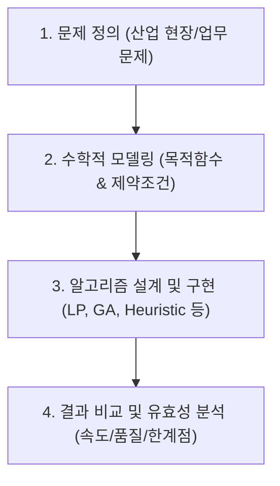

# 제조 데이터 분석과 최적화 (MDAO) 강의 요약 - 2026년 5월 12일

본 강의에서는 제조 최적화 문제를 정의하고 이를 해결하기 위해 사용되는 **5가지 최적화 방법론(그리디 Heuristics, 동적 계획법, 정수 계획법, 유전 알고리즘, 베이지안 최적화)**의 원리와 장단점을 비교 분석했습니다. 아울러 남은 학기 동안 진행될 **톰 프로젝트(Term Project)**의 일정, 설계 가이드라인 및 평가 기준을 설명했습니다.

---

## 1. 톰 프로젝트(Term Project) 일정 및 진행 가이드

### 1) 주요 일정 및 데드라인
*   **제안서 마감**: 13주차 수업 시간 전 (**2026년 5월 26일 19:00**)
*   **중간 피드백**: 13주차 수업 중 교수자 1:1 피드백 및 공통 보완점 가이드 제공
*   **최종 발표**: 14주차 및 15주차에 무작위 추첨으로 반씩(각 11명) 나누어 진행

### 2) 제안서 및 발표 구성 프로세스 (평가 핵심)
발표 자료는 다음의 기승전결(프로세스)을 명확히 갖추어야 좋은 평가를 받습니다.

*   **산업적 맥락**: 본인의 실제 업무나 관심 산업 분야의 문제(보안 데이터인 경우 마스킹/블러 처리 허용)를 선정합니다.
*   **알고리즘 매칭**: 문제의 성격에 적합한 최적화/AI 방법론을 선정하여 구현해야 합니다. (단순 구현 수준보다 논리적 설계 중요)
*   **비교 분석 필수**: 최적화 기법을 적용할 때 하나의 알고리즘 결과만 제시하지 않고, 여러 방법론의 결과 및 실행 시간을 다각도로 비교 분석하는 그래프나 테이블을 포함할 것을 권장합니다.

---

## 2. 제조 최적생산 문제 상황 정의

**[가구 제조 공장 사례]**
*   **생산 대상**: 책상 (Desk), 의자 (Chair), 선반 (Shelf)
*   **목적함수**: 총 이익 최대화

    $$\max \quad 70,000 \cdot x_{\text{desk}} + 50,000 \cdot x_{\text{chair}} + 30,000 \cdot x_{\text{shelf}}$$

*   **제약 조건 (Constraints)**:
    *   기계 A 가동 시간: 최대 $40$ 시간
    *   기계 B 가동 시간: 최대 $30$ 시간
    *   원자재 보유량: 최대 $45\text{ kg}$

---

## 3. 5대 최적화 알고리즘 비교 분석

동일한 생산 최적화 문제를 풀기 위해 각기 다른 5가지 접근 방식을 활용할 수 있습니다.

### 1) 그리디 휴리스틱 (Greedy Heuristic)
*   **개념**: 매 순간 가장 좋아 보이는 선택을 우선하는 탐욕 알고리즘입니다.
*   **구현**: 자원 대비 이익률(효율)을 계산하여 책상(1위) -> 의자(2위) -> 선반(3위) 순으로 우선순위를 매긴 뒤, 자원이 허용하는 한 1위 품목을 최대한 생산하고 남는 자원으로 차순위를 생산합니다.
*   **특징**: 실행 속도가 가장 빠르지만, 전역 최적해(Global Optimum)를 보장하지 못합니다. (본 예시에서는 $93$만 원의 이익을 내어 최적해 $97$만 원에 미치지 못함)

### 2) 동적 계획법 (Dynamic Programming, DP)
*   **개념**: 큰 문제를 작은 하위 문제로 나누고, 그 결과(하위 문제의 최적해)를 테이블에 기록(Memoization)해가며 최종 해를 구하는 방법입니다.
*   **특징**: 수학적으로 최적해를 보장하지만, 결정 변수와 제약 조건이 많아질수록 필요한 메모리와 연산량이 기하급수적으로 늘어나는 **"차원의 저주(Curse of Dimensionality)"**가 발생합니다.

### 3) 정수/선형 계획법 (ILP/LP) - Python `PuLP` 라이브러리
*   **개념**: 목적함수와 제약조건이 선형 관계일 때 수학적인 경계선 분석(Branch & Bound 등)을 통해 최적해를 도출합니다.
*   **구현**: Python의 `PuLP` 라이브러리를 사용하여 변수를 선언하고 제약식을 추가하여 풉니다.
*   **특징**: 문제 규모가 작거나 선형인 경우 매우 정밀하고 빠른 속도로 전역 최적해를 보장합니다.

### 4) 유전 알고리즘 (Genetic Algorithm, GA)
*   **개념**: 생물의 진화 메커니즘(선택, 교차, 변이)을 모방한 메타 휴리스틱 최적화 기법입니다.
*   **동작 과정**:
    1.  생산량 벡터 `[책상, 의자, 선반]`를 하나의 개체(유전자)로 정의합니다.
    2.  이익(적합도, Fitness)이 높은 유전자를 선택(Selection)합니다.
    3.  부모 유전자의 일부 값을 섞어 자식 유전자를 만드는 교차(Crossover)를 수행합니다.
    4.  국소 최적해(Local Minima) 탈출을 위해 무작위로 값을 변형하는 돌연변이(Mutation)를 가합니다.
*   **특징**: 복잡하고 비선형적인 탐색 공간에서 유연하게 작동하며 최적해에 근접합니다. (본 실습에서는 약 25세대 만에 최적해인 $97$만 원에 수렴)

### 5) Optuna (베이지안 블랙박스 최적화)
*   **개념**: 주로 AI 모델의 하이퍼파라미터 튜닝에 쓰이는 베이지안 최적화(TPE 알고리즘 등)를 제조 수치 결정 문제에 적용한 기법입니다.
*   **특징**: 목적 함수 내부가 블랙박스 구조이거나 비선형 제약조건이 많을 때 강력합니다. 다만 수백 번 이상의 평가(Trials)를 반복해야 하므로 수학적 솔버에 비해 연산 시간(Execution Time)이 오래 걸립니다.

---

## 4. 핵심 요약 및 현업 적용 방안

1.  **적정 기술의 원칙**: 제조 현장에 무조건 딥러닝이나 복잡한 AI 알고리즘을 도입하는 것은 비효율적입니다. 수학적 수식 정의가 명확하고 규모가 작다면 정수 계획법(LP/ILP)이나 휴리스틱으로 푸는 것이 연산 속도 및 신뢰성 측면에서 훨씬 유리합니다.
2.  **AI 최적화가 필요한 임계점**: 결정 변수가 수백 개 이상(예: 다품종 생산 라인 스케줄링)으로 확장되면 연산 복잡도가 NP-Hard로 치닫습니다. 이때는 수학적 솔버로 해를 구하는 것이 불가능하므로, 유전 알고리즘이나 강화학습(RL) 같은 메타 휴리스틱 및 기계학습 모델이 핵심 솔루션으로 작용하게 됩니다.
