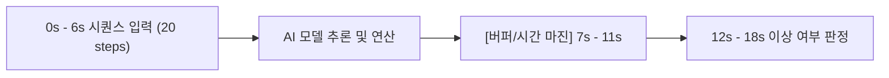
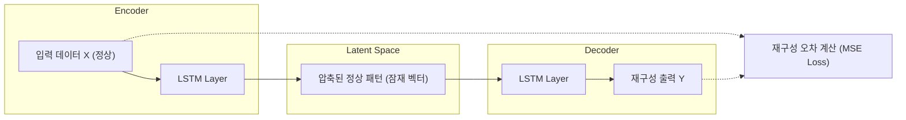
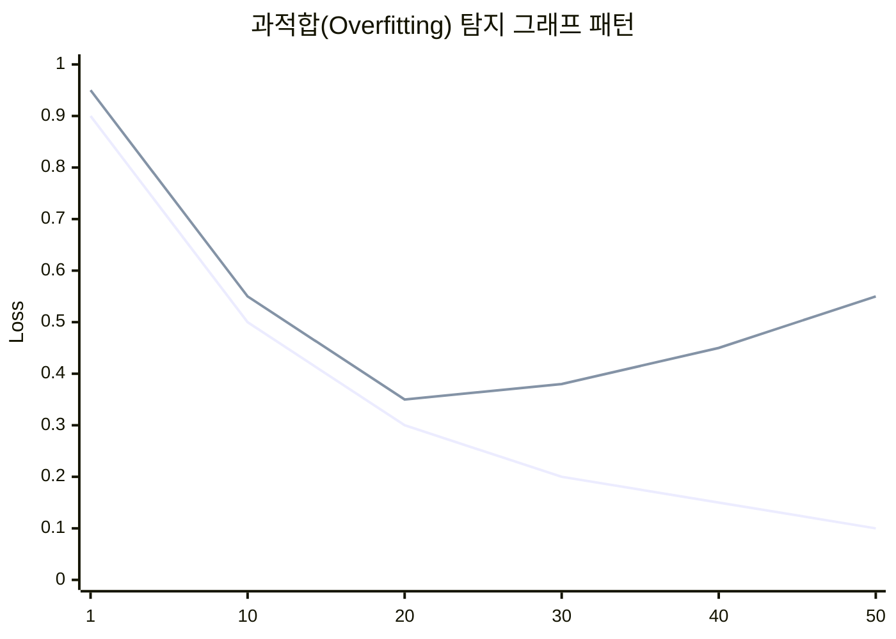

# 제조 데이터 분석과 최적화 (MDAO) 강의 요약 - 2026년 3월 31일

본 강의에서는 제조 설비의 **예지보전(Predictive Maintenance)**을 위한 AI 모델 개발 파이프라인과 대표적인 비지도 학습 모델인 **LSTM 오토인코더(LSTM Autoencoder)**의 개념 및 실제 파이토치(PyTorch) 구현 방법, 그리고 실험 시각화 도구인 **텐서보드(TensorBoard)** 활용법을 다루었습니다.

---

## 1. 제조 예지보전 데이터셋 개요

제조 환경에서 수집되는 센서 데이터는 대부분 정상 데이터이며, 고장(이상) 데이터는 매우 드물게 발생합니다. 이러한 불균형 데이터 환경에서의 예지보전 성능 확보가 핵심 과제입니다.

### 1) 데이터셋 구성 및 시나리오
본 실습에서는 용접 공정 예지보전을 예시로 하여 두 가지 데이터셋을 비교 분석합니다.
*   **KAMP(한국인공지능제조플랫폼) 데이터셋**: 비교적 단순하고 패턴이 정형화되어 있어 전통적인 기계 학습이나 기본 모델로도 100%에 가까운 성능이 나옵니다.
*   **캐글(Kaggle) 데이터셋**: 실제 현장 데이터와 유사하게 노이즈가 많고 복잡하여, 성능(F1-score 등)을 올리기 위해 정교한 모델 설계가 필요한 데이터셋입니다. (과제용)

### 2) 용접 예지보전의 주요 변수 (Features)
용접 파이프라인에서 5분간 수집된 5가지 핵심 물리량 변수를 모니터링합니다.
*   전류 (Current)
*   전압 (Voltage)
*   용접 속도 (Welding Speed)
*   기타 공정 변수 등 (총 5개 피처)

---

## 2. 데이터 전처리 및 피처 엔지니어링

### 1) 데이터 스케일링 (Min-Max Scaling)
센서들마다 측정되는 물리적 값의 단위(Scale)가 크게 다릅니다. 예를 들어 전류는 약 $300\text{ A}$, 송급 속도는 $9,000\text{ mm/min}$ 등 스케일 차이가 클 경우, AI 모델이 특정 변수에 편향(Bias)될 위험이 있습니다.
이를 방지하기 위해 모든 피처를 $0$과 $1$ 사이의 범위로 정규화합니다.

$$\text{Scaled Value} = \frac{x - x_{\min}}{x_{\max} - x_{\min}}$$

### 2) 시계열 시퀀스 생성 및 예측 오프셋 (Prediction Offset)
*   **시퀀스 길이 (Sequence Length)**: 20 스텝 (예: 0초 ~ 6초 구간의 시계열 데이터 흐름 분석)
*   **예측 텀 (Term) 부여**: 0~6초의 데이터를 바탕으로 바로 뒤(7초)가 아닌, 일정한 버퍼(예: 12~18초)를 두고 이후 시점의 정상/이상 여부를 예측합니다.
*   **시간 차(Term)를 두는 이유 (설계적 관점)**:
    AI 모델이 연산을 수행하고 이상 판단을 내리는 데 물리적인 시간(latency)이 소요됩니다. 이상을 탐지한 즉시 반응하기 위해 제어 장치가 준비할 수 있도록 시스템이 허용하는 마진(margin)을 확보해 주기 위해 오프셋을 설계 단계에서 반영합니다.



---

## 3. LSTM 오토인코더 (LSTM Autoencoder) 아키텍처

비지도 학습 기반의 이상 탐지는 **"정상 데이터만으로 모델을 학습시켜 정상의 패턴을 압축 및 복원하게 만들고, 이상 데이터가 들어왔을 때는 제대로 복원하지 못한다"**는 가정을 바탕으로 합니다.

### 1) 인코더(Encoder)와 디코더(Decoder) 구조
*   **인코더 (Encoder)**: 입력 데이터 $X$의 차원을 축소하여 핵심 정상 패턴만 담은 잠재 공간(Latent Space, Bottleneck)으로 압축합니다.
*   **디코더 (Decoder)**: 잠재 공간의 정보로부터 원래 입력 $X$와 동일한 형태의 출력 $Y$를 재구성(Reconstruction)합니다.



### 2) 비지도 학습 기반 이상 탐지 메커니즘
1.  **학습 단계**: 정상 데이터만을 모델에 입력하여 입력과 출력이 최대한 같아지도록 가중치를 학습합니다.
2.  **추론 단계**: 새로운 데이터가 입력되었을 때, 입력값 $X$와 모델의 출력값 $Y$ 사이의 **재구성 오차(Reconstruction Error)**를 계산합니다.
3.  **이상 판정**: 재구성 오차가 미리 설정한 **임계값(Threshold)**보다 크면 이상(Anomaly), 작으면 정상(Normal)으로 분류합니다.

---

## 4. 모델 튜닝 및 과적합 방지 기법

실제 제조 AI 프로젝트 및 캐글 과제 수행 시 성능 향상을 위해 활용해야 하는 핵심 딥러닝 컴포넌트입니다.

### 1) 배치 정규화 (Batch Normalization)
레이어를 거칠 때마다 입력 데이터의 분포가 계속해서 변하는 내부 공변량 변화(Internal Covariate Shift) 문제를 방지합니다. 각 배치별로 평균과 분산을 정규화하여 학습 속도를 가속화하고 경사 소실(Vanishing Gradient) 문제를 개선합니다.

### 2) 드롭아웃 (Dropout)
학습 과정에서 무작위로 일부 뉴런을 연결 해제(Deactivate)하여 특정 가중치 노드에 모델이 과도하게 의존하는 현상을 방지합니다. 앙상블 효과를 유도하여 모델의 일반화 성능을 높입니다.

### 3) 셔플링 (Shuffling)
시계열적 순서 자체에 고착화되어 학습 데이터 내 엉뚱한 패턴(예: 특정 클래스가 번갈아 나오는 순서 등)을 학습하지 않도록, 트레이닝 단계에서 훈련 데이터를 뒤섞는 과정이 필수적입니다. 단, 모델을 평가(Validation / Test)할 때는 셔플하지 않고 원래 순서대로 투입합니다.

---

## 5. 텐서보드(TensorBoard)를 활용한 모니터링 및 과적합 진단

텐서보드는 머신러닝 실험 과정을 웹 GUI 상에서 시각화하고 실시간으로 모니터링하는 도구입니다.

### 1) 훈련 손실(Train Loss) vs 검증 손실(Validation Loss) 분석
*   **정상 학습**: 에포크(Epoch)가 진행됨에 따라 Train Loss와 Validation Loss가 함께 완만하게 하락합니다.
*   **과적합(Overfitting) 발생**: 훈련 데이터에 너무 익숙해진 나머지 Train Loss는 계속 하락하지만, 새로운 데이터인 Validation Loss는 어느 순간부터 정체되거나 오히려 상승하는 패턴을 보입니다.
*   **해결책**: 검증 손실(Validation Loss)이 최소가 되는 최적의 에포크 시점의 가중치 파라미터(`.pt` / `.pth` 파일)만 저장하여 최종 모델로 채택합니다.


*(범례: 파란색 실선 = Train Loss, 주황색 실선 = Validation Loss. 특정 시점 이후 Validation Loss가 상승하는 구간이 과적합 시점)*

### 2) 텐서보드 구동 프로세스
1.  **코드 내 SummaryWriter 정의**:
    ```python
    from torch.utils.tensorboard import SummaryWriter
    writer = SummaryWriter(log_dir='runs/welding_experiment')
    ```
2.  **훈련 루프에서 지표 기록**:
    ```python
    writer.add_scalar('Loss/train', train_loss, epoch)
    writer.add_scalar('Loss/val', val_loss, epoch)
    ```
3.  **터미널에서 웹 서버 실행**:
    ```bash
    tensorboard --logdir=runs
    ```
4.  출력되는 로컬 호스트 주소(예: `http://localhost:6006`)에 접속하여 실시간 그래프 모니터링 수행.

---

## 6. 실습 및 과제 안내
*   **목표**: 캐글(Kaggle) 예지보전 데이터셋을 활용하여 모델 아키텍처(MLP, LSTM, 하이퍼파라미터 등)를 튜닝하고 **F1-score 0.70 (70%) 이상**을 달성할 것.
*   **주요 접근 방향**:
    *   입력 피처의 추가적인 가공 및 정규화 방식 조정
    *   인코더/디코더 레이어 깊이 및 노드 수 변경
    *   적절한 Batch Normalization, Dropout 비율 튜닝
    *   최적의 임계값(Anomaly Threshold)을 탐색하여 Confusion Matrix 성능 개선
